# VoiceClientAndCaddy 执行流程图

## 部署脚本执行流程

### 安装脚本流程 (install.sh / install.ps1)

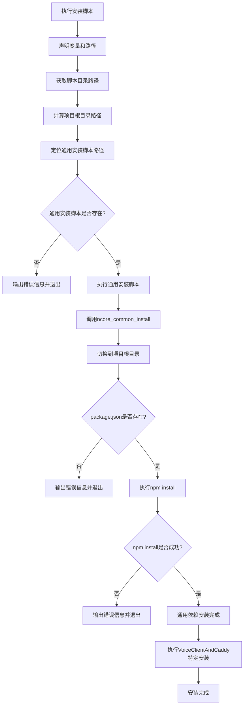

### 部署脚本流程 (deploy.sh / deploy.ps1)

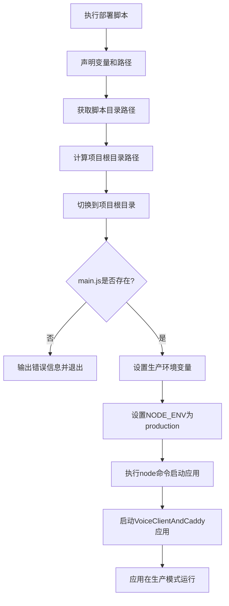

## Python环境检查和EdgeTTS安装流程

### Python环境验证流程

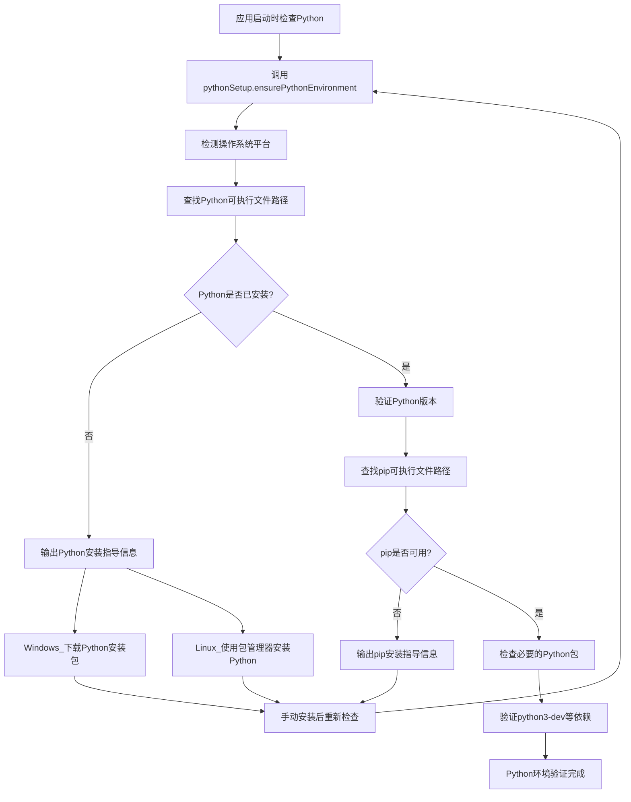

### EdgeTTS安装和验证流程

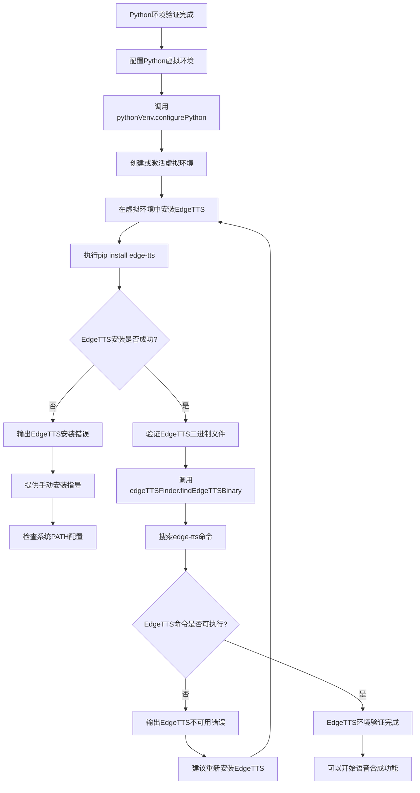

## 完整的环境准备和应用启动流程

### 从部署到运行的完整流程

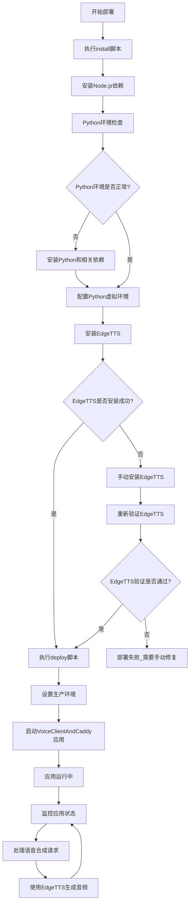

## 整体启动流程（由PHP Laravel接管）

### 架构变更说明
- **主控制器**: PHP Laravel项目负责API接口和业务逻辑
- **子应用模式**: VoiceClientAndCaddy作为Laravel的子应用模块
- **外置存储**: 静态文件和数据库使用外部目录，避免项目目录过大
- **环境检查**: 每次API请求都进行环境验证，确保依赖可用

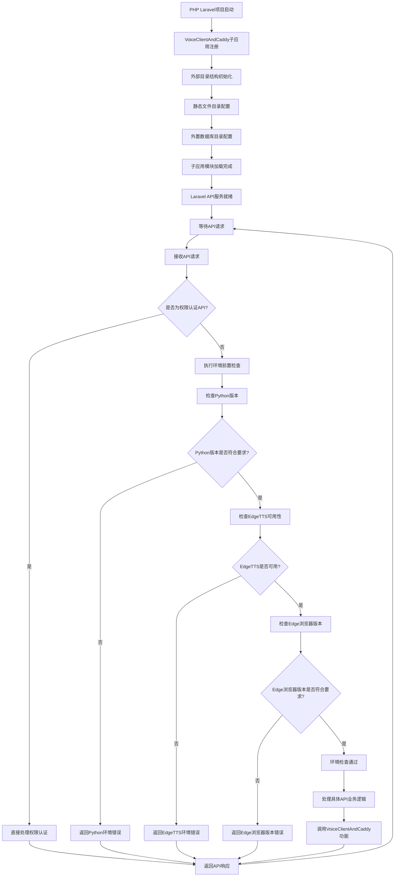

## 外部目录结构和配置流程

### 目录分离设计理由

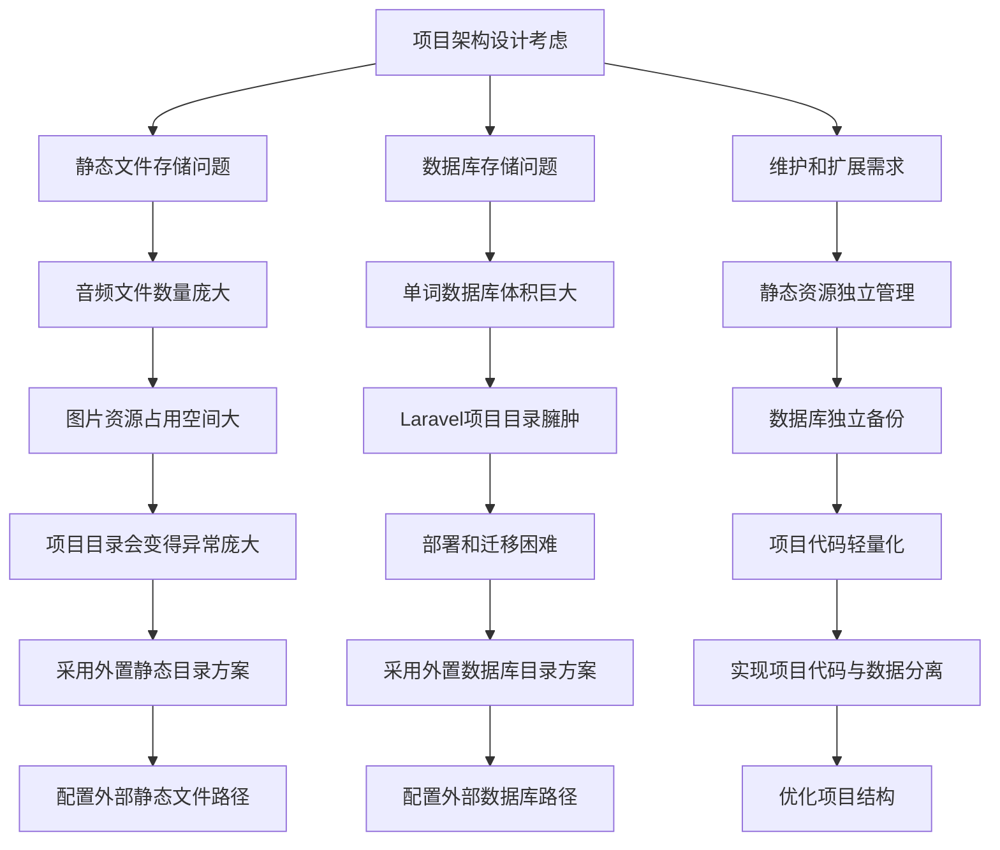

### 外部目录初始化流程

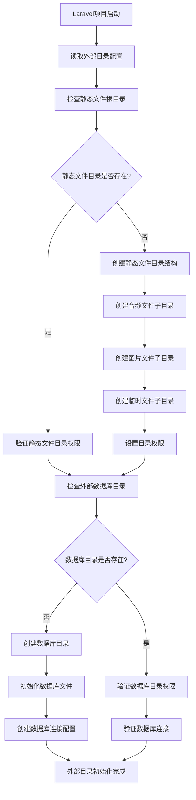

## Laravel API前置检查中间件流程

### 环境检查中间件设计

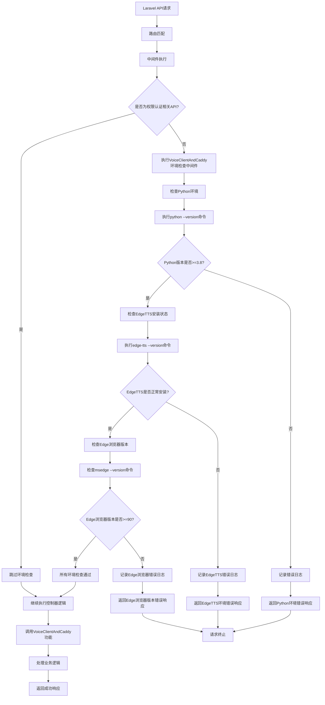

### PHP Laravel与VoiceClientAndCaddy集成流程

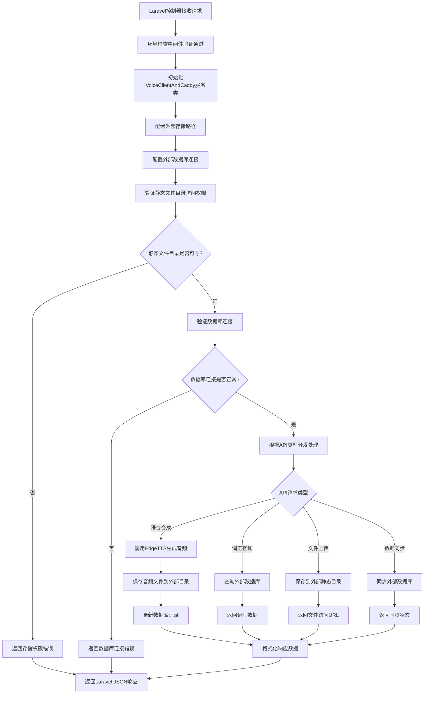

### 部署脚本确保环境安装流程

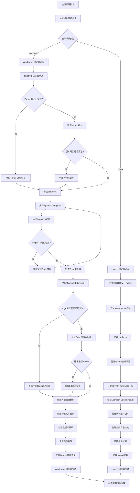

## 架构变更总结

### 设计理由和优势

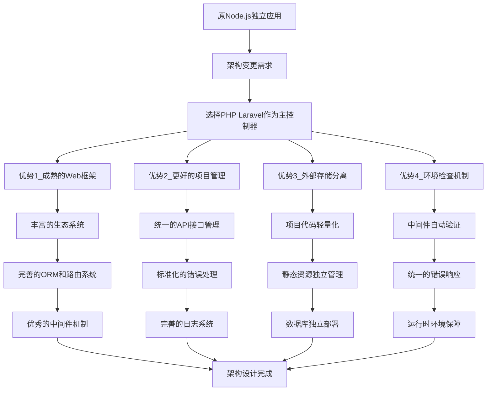

### 外部目录结构说明

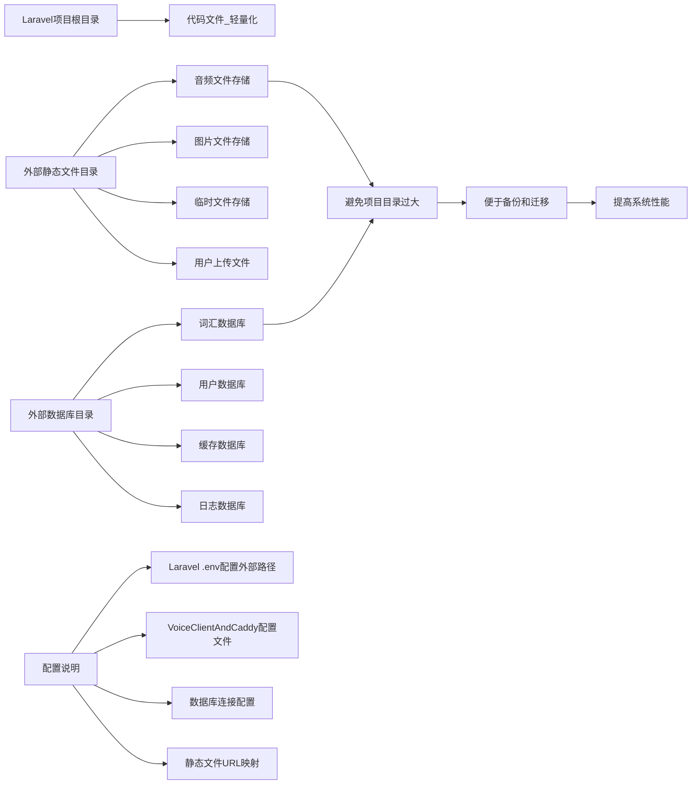

## ClientMaster 启动流程

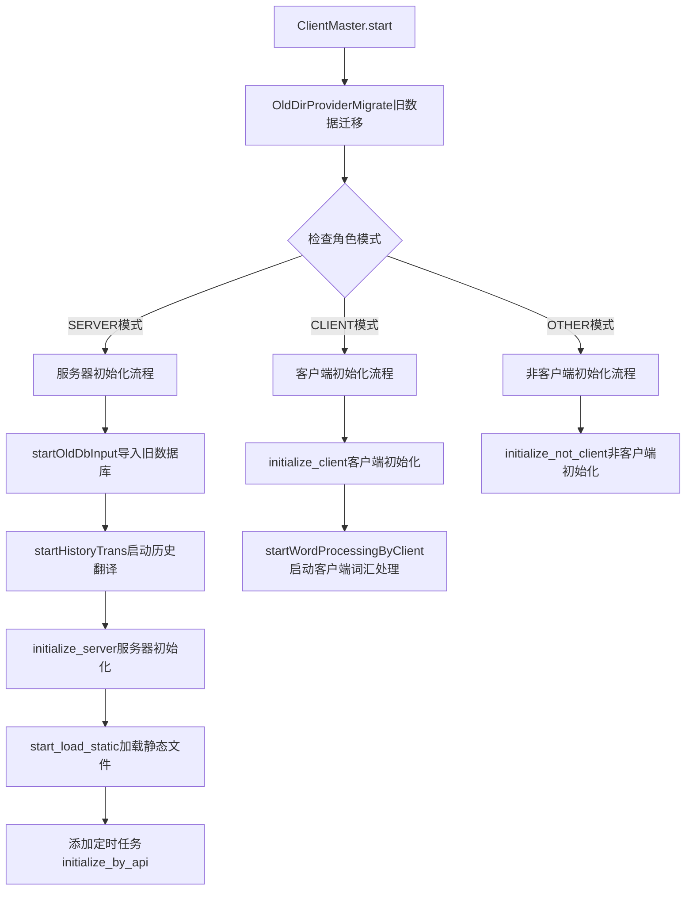

## 服务器模式详细流程

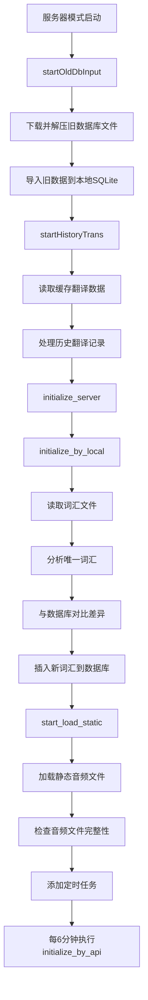

## 客户端模式流程

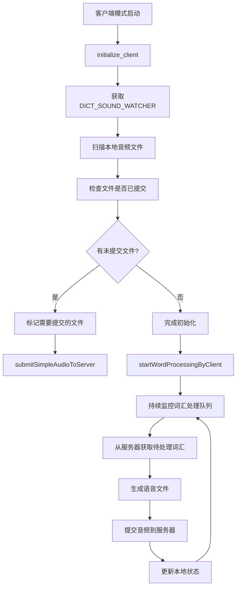

## 语音生成流程

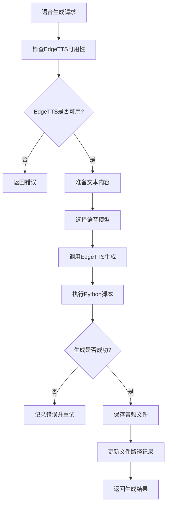

## HTTP API 处理流程

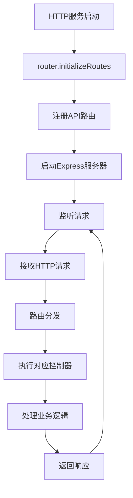

## 数据库操作流程

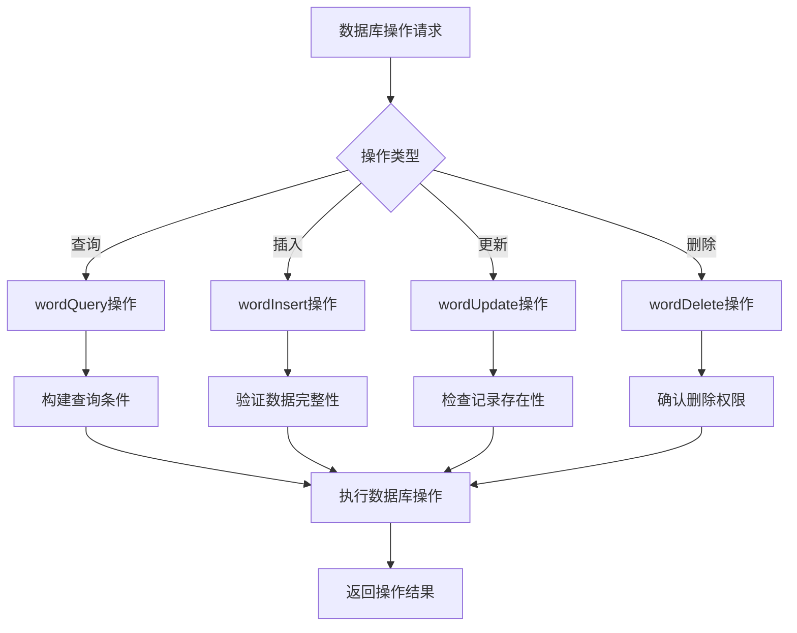