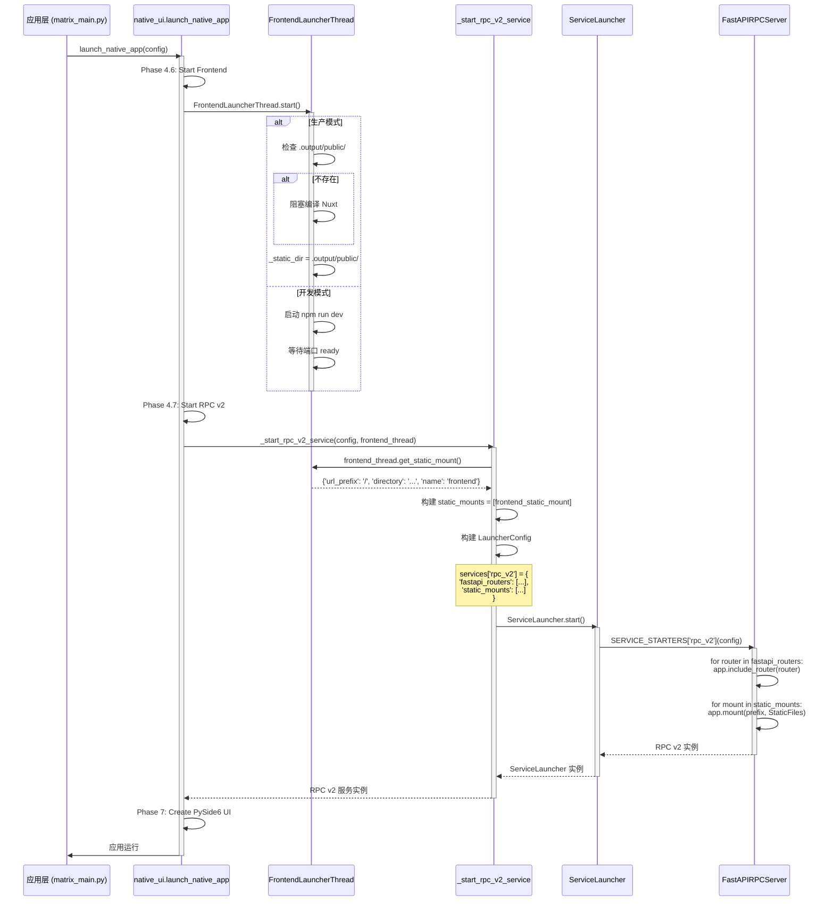
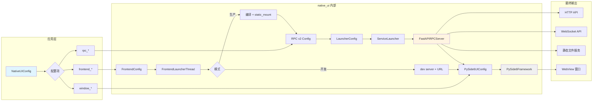
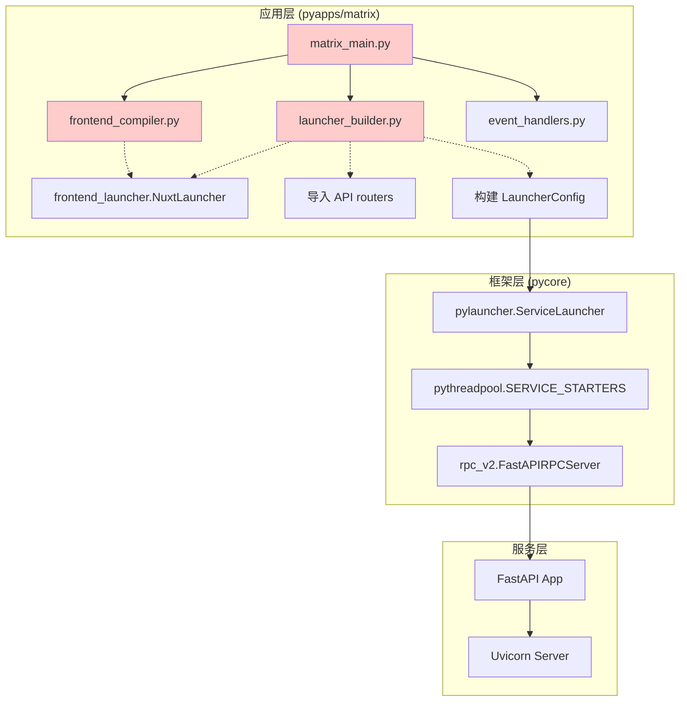
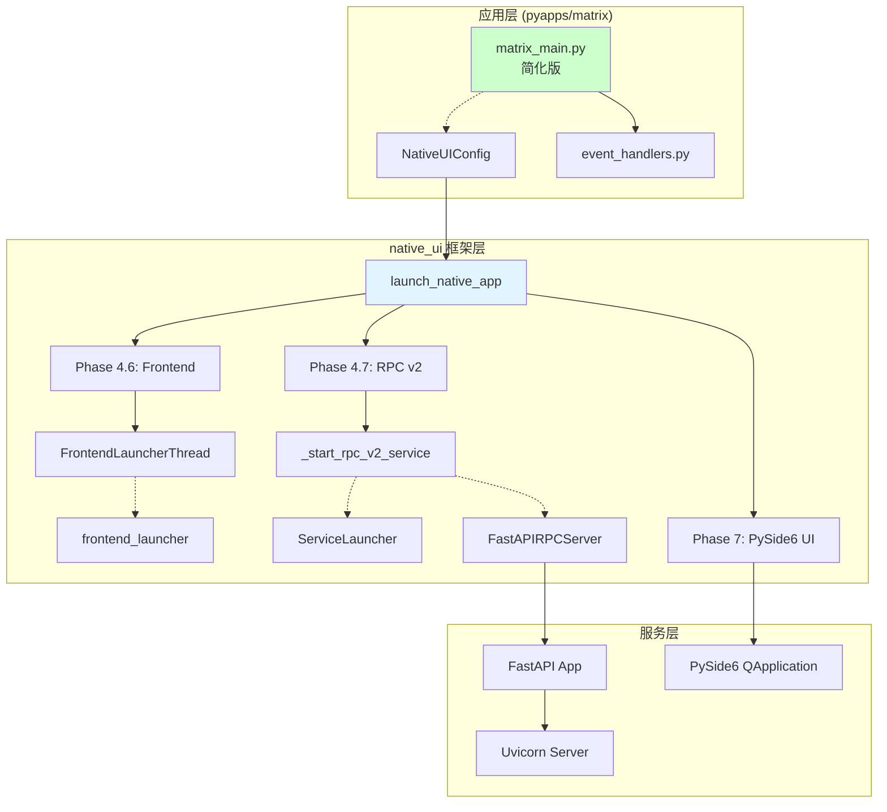
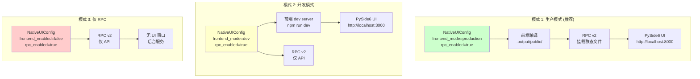
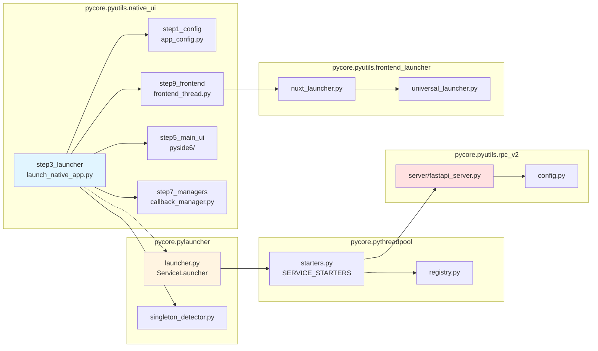
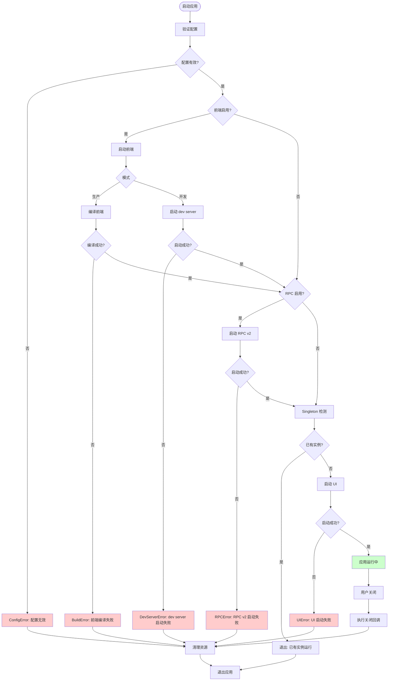
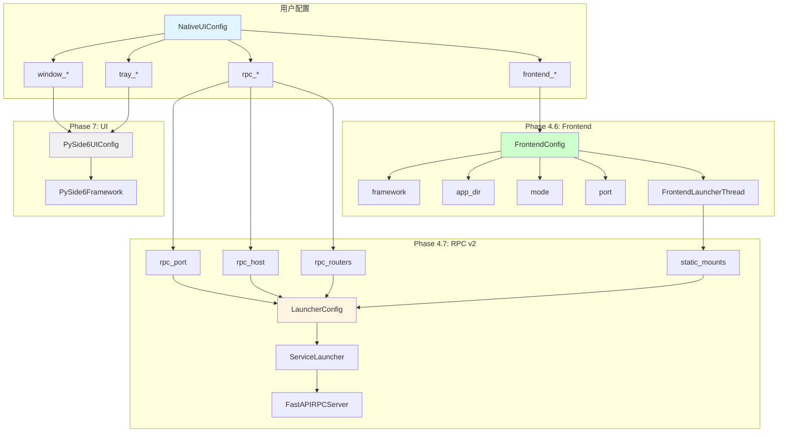
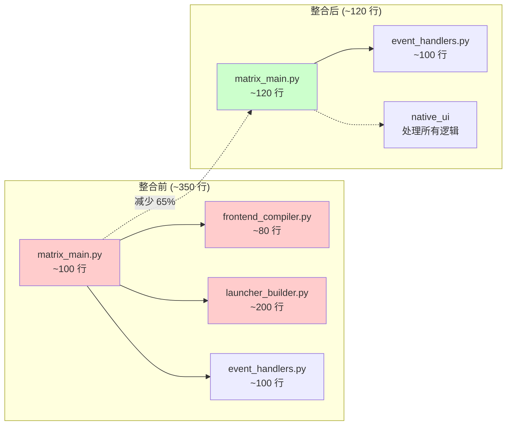

# Native UI + RPC v2 架构流程图

## 1. 整合后完整启动流程

```mermaid
flowchart TD
    Start([应用启动]) --> Config[创建 NativeUIConfig]
    Config --> Launch[launch_native_app]

    Launch --> P1[Phase 1: 端口分配]
    P1 --> P2[Phase 2: URL 处理]
    P2 --> P3[Phase 3: 回调管理器]
    P3 --> P45[Phase 4.5: Timer Manager]
    P45 --> P46{Phase 4.6: Frontend 启用?}

    P46 -->|是| FE_Start[启动 Frontend Thread]
    P46 -->|否| P47

    FE_Start --> FE_Mode{前端模式}
    FE_Mode -->|生产模式| FE_Prod[检查编译输出]
    FE_Mode -->|开发模式| FE_Dev[启动 dev server]

    FE_Prod --> FE_Prod_Check{输出存在?}
    FE_Prod_Check -->|否| FE_Compile[阻塞编译]
    FE_Prod_Check -->|是| FE_Prod_Mount[准备 static_mount]
    FE_Compile --> FE_Prod_Mount

    FE_Dev --> FE_Dev_Install[自动 pnpm install]
    FE_Dev_Install --> FE_Dev_Run[自动 npm run dev]
    FE_Dev_Run --> FE_Dev_Wait[等待端口 ready]
    FE_Dev_Wait --> P47

    FE_Prod_Mount --> P47{Phase 4.7: RPC v2 启用?}

    P47 -->|是| RPC_Start[启动 RPC v2 Service]
    P47 -->|否| P5[Phase 5: Singleton 检测]

    RPC_Start --> RPC_Mount{自动挂载前端?}
    RPC_Mount -->|是| RPC_Get[获取 static_mount]
    RPC_Mount -->|否| RPC_NoMount[不挂载静态文件]

    RPC_Get --> RPC_Config[构建 RPC v2 配置]
    RPC_NoMount --> RPC_Config

    RPC_Config --> RPC_Launch[ServiceLauncher.start]
    RPC_Launch --> RPC_FastAPI[FastAPIRPCServer]

    RPC_FastAPI --> RPC_Routers[挂载 API Routers]
    RPC_Routers --> RPC_Static{有 static_mounts?}
    RPC_Static -->|是| RPC_Mount_Static[app.mount StaticFiles]
    RPC_Static -->|否| P5
    RPC_Mount_Static --> P5

    P5 --> P5_Check{已有实例?}
    P5_Check -->|是| P5_Exit[退出]
    P5_Check -->|否| P6[Phase 6: 启动窗口]

    P6 --> P6_Check{显示调试窗口?}
    P6_Check -->|是| P6_Debug[启动 Tkinter 调试窗口]
    P6_Check -->|否| P7[Phase 7: 主 UI]

    P6_Debug --> P7
    P7 --> P7_UI[创建 PySide6 WebView]
    P7_UI --> P7_Wire[连接回调到 CallbackManager]
    P7_Wire --> P7_Run[QApplication.exec]
    P7_Run --> End([应用运行中])

    P5_Exit --> Exit([退出])

    style FE_Start fill:#e1f5ff
    style RPC_Start fill:#fff4e1
    style P7_UI fill:#f0f0f0
```



## 2. 信息流：静态文件挂载协调



## 3. 数据流：配置到服务



## 4. 架构层次对比

### 4.1 整合前架构（当前）



### 4.2 整合后架构（目标）



## 5. 三种模式的架构差异



## 6. 组件依赖关系



## 7. 时序图：完整生命周期

```mermaid
sequenceDiagram
    participant User
    participant Main as matrix_main.py
    participant Native as launch_native_app
    participant FE as FrontendThread
    participant RPC as RPC v2 Service
    participant UI as PySide6 UI
    participant CB as CallbackManager

    User->>Main: python pymain.py app=matrix
    Main->>Main: 创建 NativeUIConfig
    Main->>Native: launch_native_app(config)

    activate Native
    Native->>Native: Phase 1-3: 初始化
    Native->>CB: 创建 CallbackManager

    Native->>FE: Phase 4.6: 启动前端
    activate FE
    FE->>FE: 编译/启动 dev server
    FE-->>Native: 前端就绪
    deactivate FE

    Native->>RPC: Phase 4.7: 启动 RPC v2
    activate RPC
    RPC->>FE: 获取 static_mount
    FE-->>RPC: static_mount config
    RPC->>RPC: 挂载静态文件 + API
    RPC-->>Native: RPC v2 就绪

    Native->>UI: Phase 7: 创建 PySide6 UI
    activate UI
    UI->>CB: 连接生命周期回调
    UI->>UI: 加载 webview URL
    UI-->>User: 显示窗口

    User->>UI: 使用应用...

    User->>UI: 关闭窗口
    UI->>CB: 触发 on_closing 回调
    CB->>RPC: 停止 RPC v2
    deactivate RPC
    CB->>FE: 停止前端服务
    deactivate FE
    UI->>CB: 触发 on_closed 回调
    deactivate UI
    deactivate Native

    Main-->>User: 应用退出
```

## 8. 错误处理流程



## 9. 配置传递路径



## 10. 代码简化对比



---

**图表说明：**
- 浅蓝色：native_ui 模块
- 浅黄色：RPC v2 相关
- 浅绿色：前端相关
- 浅灰色：UI 相关
- 浅红色：需要删除/简化的代码

**查看方式：**
这些 Mermaid 图表可以在支持 Mermaid 的 Markdown 查看器中渲染，例如：
- GitHub/GitLab
- VS Code (with Mermaid extension)
- Obsidian
- Typora
- 在线工具：https://mermaid.live/

**文档版本**: v1.0
**创建时间**: 2025-12-07
**作者**: Claude (AI Assistant)
