# ROSBOT 启动流程（DOT 版，流程驱动）

**驱动方式**：按流程顺序执行，不按 tick。点击“启动监控”后 `RosbotFlowRunner` 在独立线程上从 F1 开始顺序执行一轮：F1 → (B → D) → C → E → F3；F3 监控结束（重启 / D3 消失 / ROSBOT 消失）后回到 F1 开始下一轮。所有等待都可取消，点击“停止监控”后流程在当前步骤立即结束。

**复用原则**：D3 正在运行就复用（直接进入 C1，不重启）；战网已登录就复用（不重启、不退出）；ROSBOT 已在线就直接进入 F3。只有在战网登录界面、断线、登录失败或超时时才处理战网。

**唯一实现**：B = `BattlenetReadyProcess`；D = `GameLaunchProcess`；C = `D3DirectProcess`；E = `RosbotRunFlow.RunEBlock`（经 `IRosbotFlowHost.RunRosbotStart`）；F3 = `F3MonitorProcess`；总流程 = `RosbotFlowRunner`。“确保战网”守护 = `BattlenetGuardRunner`，与监控共用同一个 B 流程（同一时刻只运行一个，监控启动时守护让出）。手动“启动 D3 / D4”也走同一个 B + D。

```mermaid
%%{init: {'themeVariables': {'fontSize': '45px', 'primaryFontSize': '45px', 'secondaryFontSize': '45px', 'tertiaryFontSize': '45px', 'fontFamily': 'arial'}}}%%
flowchart TB
    subgraph A["总流程 RosbotFlowRunner（独立线程，顺序执行）"]
        A1_Start["[A1] 点击启动监控：置监控开关，启动流程线程"]
        A1_Stop["[A1s] 点击停止监控：取消流程（当前步骤立即结束）"]
        F1_HasD3{"[F1] D3 是否在运行？"}
        F2_RosbotOnline{"[F2] ROSBOT 是否在线（running / paused）？"}
        A1_Start --> F1_HasD3
    end

    subgraph B["B 战网就绪 BattlenetReadyProcess（顺序循环，每 2s 探测一次客户端状态）"]
        B1_Probe{"[B1] 探测战网状态（BattlenetClientStateDetector）"}
        B2_Ready["[B2] 已登录主界面 / 游戏启动中 → 复用"]
        B3_Start["[B3] 未运行 → 启动战网，等 5s"]
        B4_Tray["[B4] 隐藏在托盘 → 托盘恢复，否则再次启动 Battle.net.exe 显示窗口（不关闭，不掉登录）"]
        B5_Region["[B5] 区服与全局设置不一致 → --setregion 重启（120s 冷却）"]
        B6_LoginCn["[B6] 国服登录页 → 同意 + 网易登录（15s 冷却）→ 网页登录自动化"]
        B7_LoginWeb["[B7] 网页登录 / 浏览器等待 → 网页登录自动化轮询"]
        B8_LoginAsia["[B8] 亚服登录页 → 已存账号密码填写提交（无则弹出凭据对话框）"]
        B9_User["[B9] 正在登录 / 安全验证 / 验证码 → 等用户，永不重启"]
        B10_Popup["[B10] 弹窗 → 关闭"]
        B11_Restart["[B11] 断线 / 登录失败 → 重启战网"]
        B12_Timeout["[B12] 异常状态（连接中、加载、离线、未知）超过 battlenet.abnormal_timeout_sec，或登录状态超过 battlenet.login_timeout_sec → 重启；休眠 / 读取账号超过 5 分钟 → 清缓存后启动"]
        B1_Probe -->|"Normal / GameStarting"| B5_Region
        B5_Region -->|"区服一致"| B2_Ready
        B5_Region -->|"已切换区服"| B1_Probe
        B1_Probe -->|"NotRunning"| B3_Start
        B1_Probe -->|"TrayHidden"| B4_Tray
        B1_Probe -->|"LoginCn"| B6_LoginCn
        B1_Probe -->|"LoginCnWeb / BrowserLoginWait"| B7_LoginWeb
        B1_Probe -->|"LoginAsia / LoginEmail / LoginPassword"| B8_LoginAsia
        B1_Probe -->|"LoggingIn / SecurityCheck / VerificationCode"| B9_User
        B1_Probe -->|"Popup"| B10_Popup
        B1_Probe -->|"Disconnected / LoginFailed"| B11_Restart
        B3_Start --> B1_Probe
        B4_Tray --> B1_Probe
        B6_LoginCn --> B12_Timeout
        B7_LoginWeb --> B12_Timeout
        B8_LoginAsia --> B12_Timeout
        B9_User --> B1_Probe
        B10_Popup --> B1_Probe
        B11_Restart --> B1_Probe
        B12_Timeout -->|"未超时，等 2s"| B1_Probe
        B12_Timeout -->|"超时 → 重启"| B1_Probe
    end

    subgraph D["D 从战网启动 D3 GameLaunchProcess（单次执行，失败不重启战网）"]
        D1_Activate["[D1] 激活战网窗口，等 1s"]
        D2_EndRosbot["[D2] 启动 D3 前结束 ROSBOT"]
        D3_Play["[D3] 点击 D3 页签 + Play（已在启动中则不再点击）"]
        D4_Wait["[D4] 等 5s，轮询 D3 窗口最多 10s"]
        D5_Found{"[D5] 找到 D3 窗口？"}
        D6_Fail["[D6] 失败：等 20s 后回到 F1"]
        D7_JustEntered["[D7] 标记“刚进入游戏”"]
        D1_Activate --> D2_EndRosbot --> D3_Play --> D4_Wait --> D5_Found
        D5_Found -->|否| D6_Fail
        D5_Found -->|是| D7_JustEntered
    end

    subgraph C["C D3 画面处理与传送 D3DirectProcess（顺序执行）"]
        C1_Resize["[C1] D3 窗口缩放到标准分辨率"]
        C2_Detect{"[C2] 截图识图（每 2s，超时 180s）"}
        C3_StartGame["[C3] 开始游戏按钮：结束 ROSBOT → 点击 → 10s 内等游戏工具栏（视为刚进入游戏），并重置 180s"]
        C4_Disconnect["[C4] 掉线（连续两次确认）→ 标记掉线，结束 D3"]
        C5_End["[C5] 超时 / C3 等待超时 → 结束 D3"]
        C6_Origin{"[C6] 刚进入游戏，或 90s 内刚传送过？"}
        C7_MCheck["[C7] 按 M 前后截图对比（相似 = 无响应 = 掉线）"]
        C8_Map["[C8] 确保地图打开：见悬赏进度即可，否则按 M 等 2s，最多两轮（找不到也继续）"]
        C9_Teleport["[C9] 缩小地图 → 等 2s → 传送两次点击 → 记录传送时间"]
        C1_Resize --> C2_Detect
        C2_Detect -->|"游戏工具栏（在游戏中）"| C6_Origin
        C2_Detect -->|"开始游戏按钮"| C3_StartGame
        C2_Detect -->|"掉线"| C4_Disconnect
        C2_Detect -->|"连接中 / 未识别，未超时"| C2_Detect
        C2_Detect -->|"超时"| C5_End
        C3_StartGame -->|"出现游戏工具栏"| C6_Origin
        C3_StartGame -->|"未出现"| C5_End
        C6_Origin -->|是| C8_Map
        C6_Origin -->|否| C7_MCheck
        C7_MCheck -->|"在线"| C8_Map
        C7_MCheck -->|"掉线"| C5_End
        C8_Map --> C9_Teleport
    end

    subgraph E["E 启动 ROSBOT RosbotRunFlow.RunEBlock（顺序执行，停止监控即中断）"]
        E1_Kill["[E1] 结束已有 ROSBOT"]
        E2_Wait["[E2] 等 1s"]
        E3_Update["[E3] 自动使用最新 ROS：找更新 zip → 解压 → 复制 RoS-BoT.ini → 更新 ros_directory；auto_start_rosbot 关闭则不启动"]
        E4_Start["[E4] 启动 ROSBOT 进程（战网休眠 / 读取账号时跳过本轮），记录 F3 起算时间"]
        E5_Task["[E5] 任务初始化"]
        E6_UI["[E6] 等窗口 / 服务器 → 点主档案 → 点 Start botting"]
        E7_Fail["[E7] 失败：等 20s 后回到 F1"]
        E1_Kill --> E2_Wait --> E3_Update --> E4_Start --> E5_Task --> E6_UI
        E4_Start -->|"未启动"| E7_Fail
    end

    subgraph F3["F3 监控 F3MonitorProcess（每 2s 一次，每 10s 刷新 D3 / ROSBOT 状态）"]
        F3_Loop{"[F3] 检查"}
        F3_Restart["[F3r] 重启请求（错误弹窗 / 内存 / 触发器 / 日志系统错误）、ROSBOT 日志掉线、ROSBOT 日志超时（含测试模式）"]
        F3_D3Gone["[F3d] D3 窗口消失"]
        F3_RosbotGone["[F3g] ROSBOT 离线超过 30s（D3 仍在）"]
        F3_RosbotRestart["[F3e] 只重启 ROSBOT 的请求（智能回响恢复失败）"]
        F4_Close["[F4] 结束 D3 → 向系统发送 F7 → 按 PID 结束 ROSBOT（重启计数、通知、错误截图、按设置关闭战网）"]
        F3_Loop -->|"正常，等 2s"| F3_Loop
        F3_Loop --> F3_Restart --> F4_Close
        F3_Loop --> F3_D3Gone --> F4_Close
        F3_Loop --> F3_RosbotGone
        F3_Loop --> F3_RosbotRestart
    end

    F1_HasD3 -->|"否"| B1_Probe
    B2_Ready -->|"D3 仍未运行"| D1_Activate
    B2_Ready -->|"D3 已出现"| F2_RosbotOnline
    F1_HasD3 -->|"是 → 复用 D3"| F2_RosbotOnline
    D7_JustEntered --> F2_RosbotOnline
    D6_Fail --> F1_HasD3
    F2_RosbotOnline -->|"否"| C1_Resize
    F2_RosbotOnline -->|"是 → 复用 ROSBOT"| F3_Loop
    C9_Teleport -->|"[A8] 成功"| E1_Kill
    C4_Disconnect --> F1_HasD3
    C5_End --> F1_HasD3
    E6_UI --> F3_Loop
    E7_Fail --> F1_HasD3
    F4_Close --> F1_HasD3
    F3_RosbotGone --> F1_HasD3
    F3_RosbotRestart --> E1_Kill

    subgraph G["确保战网守护 BattlenetGuardRunner（battlenet.ensure_normal）"]
        G1_Check{"[G1] 每 10s：监控未运行且 D3 未运行？"}
        G2_B["[G2] 运行 B（不激活窗口）；监控启动时立即让出"]
        G1_Check -->|是| G2_B --> G1_Check
        G1_Check -->|"否 → 不动战网"| G1_Check
    end
```

