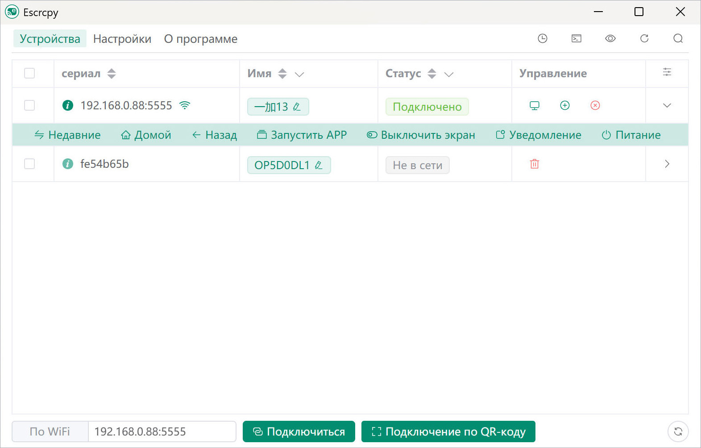

  

# Escrcpy

📱 Отображайте и управляйте своим Android-устройством с помощью scrcpy в графическом режиме, работающим на Electron. [Документация на китайском](https://github.com/viarotel-org/escrcpy/blob/main/README-CN.md)

  

## Возможности

- 🏃 Синхронизация: Более быстрая синхронизация с Scrcpy благодаря веб-технологиям
- 🤖 Автоматизация: Автоподключение устройств, автоматическое зеркалирование, пользовательские скрипты, запланированные задачи
- 💡 Настройка: Управление несколькими устройствами, независимые конфигурации, пользовательские заметки, импорт/экспорт настроек
- 📡 Беспроводное подключение: Быстрое подключение через сканирование QR-кода
- 🔗 Обратная привязка: Обратная привязка Gnirehtet
- 🪟 Расположение окон: Визуальный интерфейс перетаскивания для точного управления расположением окон нескольких устройств с настраиваемым позиционированием и размерами
- 🎨 Темы: Светлый режим, темный режим, следование системной теме
- 😎 Легковесность: Нативная поддержка, отображает только экран устройства
- ⚡️ Производительность: 30~120 FPS в зависимости от устройства
- 🌟 Качество: 1920×1080 или выше
- 🕒 Низкая задержка: 35~70 мс
- 🚀 Быстрый запуск: Первое изображение отображается примерно через 1 секунду
- 🙅‍♂️ Ненавязчивость: Не оставляет файлов установки на Android-устройствах
- 🤩 Преимущества для пользователей: Нет аккаунтов, нет рекламы, не требует интернет-соединения
- 🗽 Свобода: Бесплатное и открытое программное обеспечение

## Установка

### Ручная установка через выпущенные пакеты

Проверьте [страницу релизов](https://github.com/viarotel-org/escrcpy/releases)

### Установка на macOS через Homebrew

См. [homebrew-escrcpy](https://github.com/viarotel-org/homebrew-escrcpy)

## Документация

- [Начало работы](https://viarotel.eu.org/guide/started)
- [Горячие клавиши](https://viarotel.eu.org/reference/scrcpy/shortcuts)
- [Операции с устройством](https://viarotel.eu.org/guide/operation)
- [Настройки](https://viarotel.eu.org/guide/preferences)
- [Обратная привязка](https://viarotel.eu.org/reference/gnirehtet/)

## Для разработчиков

Если вы разработчик и хотите запустить или помочь улучшить этот проект, обратитесь к [документации по разработке](https://github.com/viarotel-org/escrcpy/blob/main/develop.md)

## Получение помощи

Как проект с открытым исходным кодом, созданный на энтузиазме, поддержка ограничена, а обновления нерегулярны.

- [FAQ](https://viarotel.eu.org/help/escrcpy)
- [Сообщить о проблеме](https://github.com/viarotel-org/escrcpy/issues)
- [Контактный email](viarotel@qq.com)

## Что дальше?

[Вехи](https://viarotel.eu.org/guide/milestones)

## Благодарности

Этот проект существует благодаря следующим проектам с открытым исходным кодом:

- [scrcpy](https://github.com/Genymobile/scrcpy)
- [adbkit](https://github.com/DeviceFarmer/adbkit)
- [electron](https://www.electronjs.org/)
- [vue](https://vuejs.org/)
- [gnirehtet](https://github.com/Genymobile/gnirehtet/)

## Поддержка

Если этот проект помог вам, рассмотрите возможность купить мне кофе, чтобы мотивировать меня на дальнейшие улучшения 😛

  
  
  

## Участники

Спасибо всем, кто внес свой вклад!

[Участники](https://github.com/viarotel/escrcpy/graphs/contributors)

## История звезд

