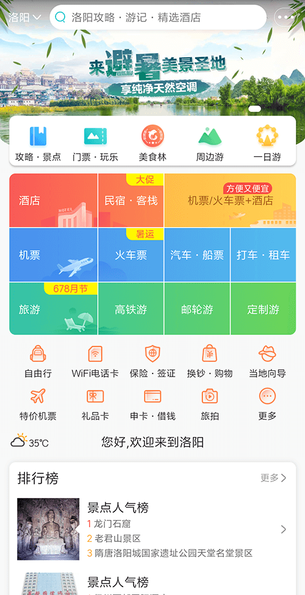
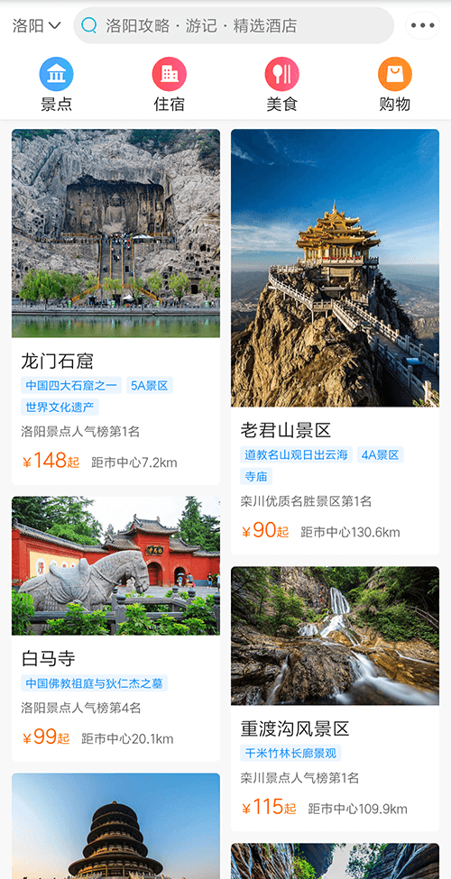
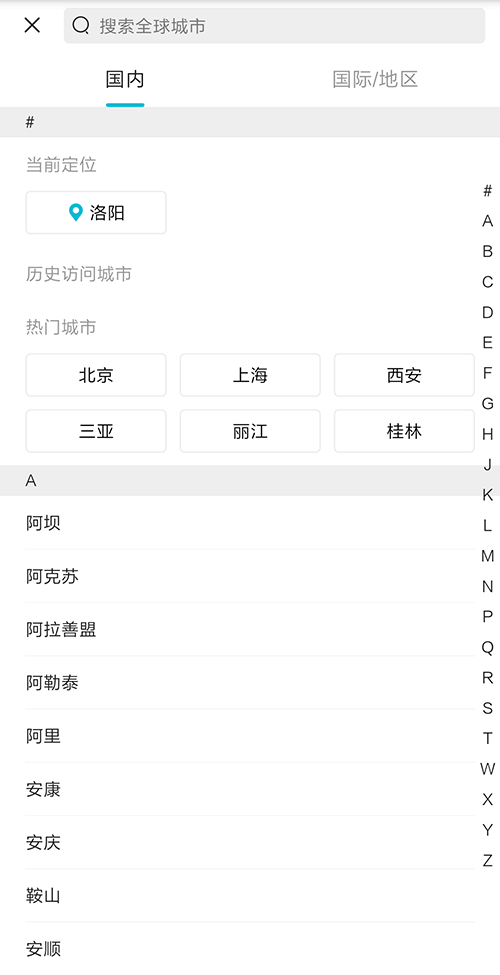

# Vue3 Travel App Clone (Qunar / Ctrip Mobile)

The original Vue2 version is archived on branch [vue2](https://github.com/quantum-rose/travel/tree/vue2)

[Live demo](https://quantum-rose.github.io/travel)

    
    
    

### Introduction

- Home page and city picker; home uses waterfall layout + infinite scroll
- Modern frontend stack
- VS Code–oriented workflow for a smoother dev experience

### Stack

`pnpm`, `Vite`, `Vue3`, `TypeScript`, `Vue Router`, `Pinia`, `Vant4`, `Scss`

> Frontend tooling moves fast — this project tracks a current Vue3 stack.
