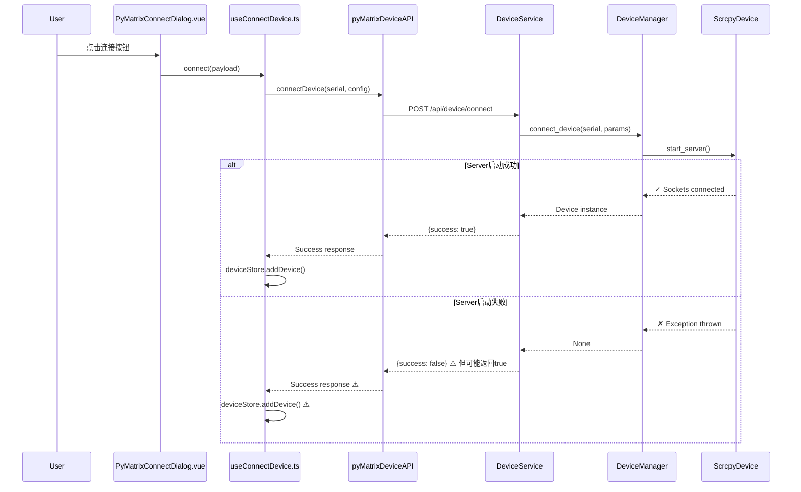
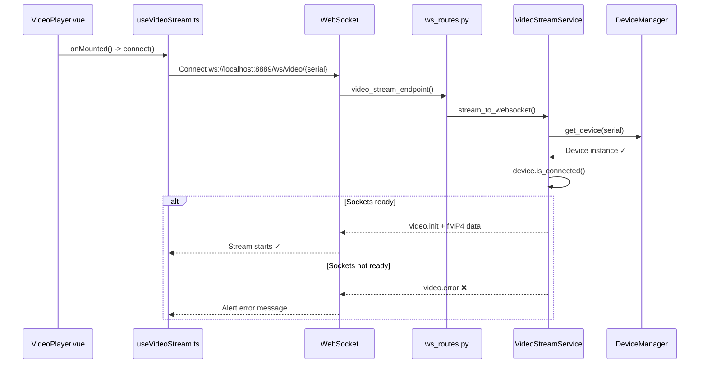

# 视频流错误全面诊断报告

**日期**: 2025-11-07
**错误**: `Video stream error: Device 6b727450 not connected`
**分析者**: AI Assistant

---

## 📋 问题概述

### 错误现象
- ✅ 前端成功调用设备连接 API
- ✅ 后端返回连接成功
- ✅ 前端识别到设备已连接
- ❌ 视频流 WebSocket 连接后立即报错：`Device not connected`

### 关键错误代码

**位置**: `poly_apps/pyMatrix/services/video_stream_service.py:80-95`

```python
# ✅ CRITICAL: Verify device is connected and ready for streaming
if not device.is_connected():
    error_msg = {
        "type": "video.error",
        "timestamp": 0,
        "data": {"error": f"Device {serial} not connected. scrcpy-server may have failed to start."}
    }
    await websocket.send_json(error_msg)
    return
```

---

## 🔍 完整问题链路分析

### 1. 前端连接流程



### 2. 视频流连接流程



---

## 🐛 根因分析

### 问题1: 设备连接状态不一致

**文件**: `poly_apps/pyMatrix/services/device_service.py:164-170`

```python
device = await self.device_manager.connect_device(serial, server_params, self.adb_path)

if device is None:
    # ⚠️ 问题: 即使 device 为 None，仍可能返回 True
    state = self.device_manager.get_device_state(serial)
    return state is not None and state.connected  # ← 这里可能返回 True
```

**问题**:
1. `DeviceManager.connect_device()` 返回 `None` (scrcpy-server 启动失败)
2. 但 `device_state` 可能被设置为 `connected=True`
3. `DeviceService.connect_device()` 返回 `True`
4. 前端认为连接成功，但设备实际未准备好

### 问题2: 时序竞争条件

**文件**: `poly_apps/pyMatrix/services/video_stream_service.py:68-76`

```python
device = self.device_manager.get_device(serial)
if not device:
    # 设备不存在 - 这个检查通过了
    error_msg = {...}
    return

# ✅ 关键检查
if not device.is_connected():
    # ❌ 这里失败了: device 存在但 _video_socket 为 None
    error_msg = {...}
    return
```

**AndroidDevice.is_connected() 定义** (`pycore/pyfoundations/device/android_device.py:89-96`):

```python
def is_connected(self) -> bool:
    return self._video_socket is not None and self._control_socket is not None
```

**ScrcpyDevice 连接过程** (`pycore/pyfoundations/device/scrcpy_device.py:64-146`):

```python
def start_server(self) -> int:
    # 1. 找端口
    self._video_port = self._find_free_port()
    self._control_port = self._find_free_port()

    # 2. 设置端口转发
    self._setup_port_forward(...)

    # 3. 启动 scrcpy-server 进程
    self._server_process = subprocess.Popen(...)

    # 4. 等待 2 秒
    time.sleep(2)  # ← 可能不够

    # 5. 检查进程是否崩溃
    if self._server_process.poll() is not None:
        raise RuntimeError(...)  # ← 这里应该抛出异常

    # 6. 连接 socket
    self._video_socket = self._connect_to_port(self._video_port)  # ← 可能超时
    self._control_socket = self._connect_to_port(self._control_port)

    # 7. 读取设备信息
    self._read_device_info()

    return self._video_port
```

**可能的失败点**:
1. **scrcpy-server 进程启动失败** - 应该在步骤 5 检测到
2. **socket 连接超时** - 步骤 6 可能阻塞或失败
3. **设备信息读取失败** - 步骤 7 可能超时

### 问题3: 异常处理不完整

**文件**: `pycore/pyutils/device_manager.py:197-216`

```python
try:
    print(f"[DeviceManager] Starting scrcpy-server for {serial}...")
    await asyncio.to_thread(device.start_server)
    print(f"[DeviceManager] ✓ scrcpy-server started successfully for {serial}")
except Exception as e:
    error_msg = f"Failed to start scrcpy-server for {serial}: {e}"
    print(f"[DeviceManager] ✗ {error_msg}")
    # ✅ CRITICAL: Return None instead of continuing
    # This ensures frontend knows the connection failed
    raise RuntimeError(error_msg)  # ← 应该抛出异常

# Verify device is truly connected (has active sockets)
if not device.is_connected():
    error_msg = f"Device {serial} scrcpy-server started but sockets not connected"
    print(f"[DeviceManager] ✗ {error_msg}")
    raise RuntimeError(error_msg)  # ← 这个检查很好
```

**问题**:
- 如果异常被吞掉或处理不当，设备可能被添加到设备池
- 但 `_video_socket` 和 `_control_socket` 为 `None`

---

## 🔧 诊断步骤

### Step 1: 检查 scrcpy-server.jar 是否存在

```bash
cd D:\programing\core_node\poly_apps\pyMatrix
ls resources/scrcpy-server.jar
```

**期望**: 文件存在且大小 > 50KB

### Step 2: 检查设备是否已授权

```bash
adb devices
```

**期望输出**:
```
List of devices attached
6b727450    device
```

**如果显示 `unauthorized`**:
```bash
# 在设备上允许 USB 调试授权
# 然后重新运行
adb devices
```

### Step 3: 手动测试 scrcpy-server 启动

```bash
# Push server
adb -s 6b727450 push D:\programing\core_node\poly_apps\pyMatrix\resources\scrcpy-server.jar /data/local/tmp/

# Test server启动
adb -s 6b727450 shell CLASSPATH=/data/local/tmp/scrcpy-server.jar app_process / com.genymobile.scrcpy.Server 3.3.3 video=true audio=false control=true
```

**期望**:
- 没有错误输出
- 服务器保持运行（不退出）

**常见错误**:
1. **Permission denied**: 设备未授权或权限不足
2. **ClassNotFoundException**: jar 文件损坏或版本不匹配
3. **Device offline**: ADB 连接不稳定

### Step 4: 检查后端日志

启动 pyMatrix 后端并查看日志：

```bash
cd D:\programing\core_node\poly_apps\pyMatrix
python -m poly_apps.pyMatrix.main
```

**期望看到的日志**:
```
[DeviceManager] Starting scrcpy-server for 6b727450...
[ScrcpyDevice] Starting scrcpy-server for 6b727450
[ScrcpyDevice] Waiting for server to start...
[ScrcpyDevice] Connecting to video port 12345...
[ScrcpyDevice] ✓ Video socket connected
[ScrcpyDevice] Connecting to control port 12346...
[ScrcpyDevice] ✓ Control socket connected
[ScrcpyDevice] Reading device info...
[ScrcpyDevice] Device info: DEVICE_NAME (1080x1920)
[ScrcpyDevice] ✓ Server started successfully for 6b727450
[DeviceManager] ✓ scrcpy-server started successfully for 6b727450
[DeviceManager] ✓ Device 6b727450 fully connected and ready for streaming
```

**如果看到错误**:
```
[ScrcpyDevice] ERROR: scrcpy-server terminated unexpectedly
[ScrcpyDevice] Return code: 1
[ScrcpyDevice] stderr: Error: ...
[DeviceManager] ✗ Failed to start scrcpy-server for 6b727450: ...
```

### Step 5: 检查端口转发

```bash
# 查看当前端口转发
adb -s 6b727450 forward --list

# 移除所有转发
adb -s 6b727450 forward --remove-all

# 重新连接设备
```

### Step 6: 检查设备连接状态

在后端添加诊断端点：

**文件**: `poly_apps/pyMatrix/api/device_routes.py`

```python
@router.get("/device/{serial}/diagnose")
async def diagnose_device(serial: str):
    """诊断设备连接状态"""
    device_service = DeviceService.instance()
    device_manager = device_service.device_manager

    device = device_manager.get_device(serial)
    state = device_manager.get_device_state(serial)

    return {
        "serial": serial,
        "exists_in_pool": device is not None,
        "state": {
            "connected": state.connected if state else False,
            "streaming": state.streaming if state else False,
            "error": state.error if state else None
        } if state else None,
        "device": {
            "has_video_socket": device._video_socket is not None if device else False,
            "has_control_socket": device._control_socket is not None if device else False,
            "is_connected": device.is_connected() if device else False
        } if device else None
    }
```

**调用诊断**:
```bash
curl http://localhost:8889/api/device/6b727450/diagnose
```

---

## 🛠️ 修复方案

### 方案A: 增强错误处理和状态验证 (推荐)

**文件**: `poly_apps/pyMatrix/services/device_service.py`

```python
async def connect_device(self, serial: str, params: Optional[Dict] = None) -> bool:
    try:
        # ... 前面的代码保持不变 ...

        # Use centralized device manager to connect
        device = await self.device_manager.connect_device(serial, server_params, self.adb_path)

        # ✅ 修复: 严格检查设备对象和连接状态
        if device is None:
            print(f"[DeviceService] ✗ Failed to create device instance for {serial}")
            return False

        # ✅ 修复: 验证设备真正连接（sockets 已建立）
        if not device.is_connected():
            print(f"[DeviceService] ✗ Device {serial} created but not connected (sockets not ready)")
            # 清理不完整的设备
            await self.device_manager.disconnect_device(serial)
            return False

        print(f"[DeviceService] ✓ Device {serial} fully connected and verified")

        # Emit app-specific event
        await self.event_bus.emit(
            EventTypes.DEVICE_CONNECTED,
            source="pyMatrix",
            data={"serial": serial, "params": effective_params, "deviceName": device_name}
        )

        return True

    except Exception as e:
        print(f"[DeviceService] ✗ Failed to connect device [{serial}]: {e}")
        import traceback
        traceback.print_exc()

        # 确保清理失败的连接
        try:
            await self.device_manager.disconnect_device(serial)
        except:
            pass

        return False
```

### 方案B: 增加重试机制

**文件**: `pycore/pyfoundations/device/scrcpy_device.py`

```python
def start_server(self) -> int:
    MAX_RETRIES = 3
    WAIT_TIME = 3  # 增加到 3 秒

    for attempt in range(MAX_RETRIES):
        try:
            # ... 启动 server 的代码 ...

            # 4. 等待 server 启动（增加等待时间）
            print(f"[ScrcpyDevice] Waiting for server to start (attempt {attempt + 1}/{MAX_RETRIES})...")
            time.sleep(WAIT_TIME)

            # 5. 检查进程状态
            if self._server_process.poll() is not None:
                stdout, stderr = self._server_process.communicate()
                error_msg = f"scrcpy-server terminated with code {self._server_process.returncode}"
                if stderr:
                    error_msg += f"\nstderr: {stderr.decode('utf-8', errors='ignore')}"

                if attempt < MAX_RETRIES - 1:
                    print(f"[ScrcpyDevice] {error_msg}. Retrying...")
                    continue
                else:
                    raise RuntimeError(error_msg)

            # 6. 连接 sockets (增加超时和重试)
            print(f"[ScrcpyDevice] Connecting to video port {self._video_port}...")
            self._video_socket = self._connect_to_port_with_retry(self._video_port, retries=3)
            print(f"[ScrcpyDevice] ✓ Video socket connected")

            print(f"[ScrcpyDevice] Connecting to control port {self._control_port}...")
            self._control_socket = self._connect_to_port_with_retry(self._control_port, retries=3)
            print(f"[ScrcpyDevice] ✓ Control socket connected")

            # 7. 读取设备信息
            print(f"[ScrcpyDevice] Reading device info...")
            self._read_device_info()

            print(f"[ScrcpyDevice] ✓ Server started successfully (attempt {attempt + 1})")
            return self._video_port

        except Exception as e:
            print(f"[ScrcpyDevice] Attempt {attempt + 1} failed: {e}")
            self.stop_server()  # 清理
            if attempt < MAX_RETRIES - 1:
                time.sleep(1)
                continue
            else:
                raise

def _connect_to_port_with_retry(self, port: int, retries: int = 3) -> socket.socket:
    """带重试的端口连接"""
    for attempt in range(retries):
        try:
            sock = socket.socket(socket.AF_INET, socket.SOCK_STREAM)
            sock.settimeout(5)  # 5秒超时
            sock.connect(('127.0.0.1', port))
            sock.settimeout(None)  # 恢复阻塞模式
            return sock
        except Exception as e:
            if attempt < retries - 1:
                print(f"[ScrcpyDevice] Port {port} connection attempt {attempt + 1} failed: {e}. Retrying...")
                time.sleep(0.5)
            else:
                raise ConnectionError(f"Failed to connect to port {port} after {retries} attempts: {e}")
```

### 方案C: 前端添加重连机制

**文件**: `poly_apps/nuxt_main/apps/app_pymatrix/components_app_pymatrix/VideoPlayer.vue`

```vue
<script setup lang="ts">
// ... 其他代码 ...

const MAX_RECONNECT_ATTEMPTS = 3;
const reconnectAttempt = ref(0);
const reconnecting = ref(false);

async function connectVideo() {
  if (!device.value) return;

  try {
    await connect();
  } catch (error) {
    console.error('[VideoPlayer] Failed to connect video stream:', error);

    // 自动重连
    if (reconnectAttempt.value < MAX_RECONNECT_ATTEMPTS) {
      reconnecting.value = true;
      reconnectAttempt.value++;

      console.log(`[VideoPlayer] Retrying connection (${reconnectAttempt.value}/${MAX_RECONNECT_ATTEMPTS})...`);

      // 等待 2 秒后重试
      setTimeout(() => {
        connectVideo();
      }, 2000);
    } else {
      // 超过重试次数，显示错误
      alert(`Failed to connect video stream after ${MAX_RECONNECT_ATTEMPTS} attempts. Please reconnect the device.`);
      reconnecting.value = false;
    }
  }
}

// 监听 video.error 消息
function handleTextMessage(message: WSRPCMessage) {
  if (message.type === 'video.error') {
    // 视频流错误，尝试重连
    if (reconnectAttempt.value < MAX_RECONNECT_ATTEMPTS) {
      setTimeout(() => {
        disconnect();
        connectVideo();
      }, 1000);
    }
  }
}
</script>

<template>
  <!-- 重连提示 -->
  <div v-if="reconnecting" class="absolute inset-0 flex items-center justify-center bg-black/80">
    <div class="text-center text-white">
      <i class="fas fa-sync fa-spin text-3xl mb-2"></i>
      <p>重新连接中... ({{ reconnectAttempt }}/{{ MAX_RECONNECT_ATTEMPTS }})</p>
    </div>
  </div>
</template>
```

### 方案D: 添加设备健康检查

**文件**: `pycore/pyutils/device_manager.py`

```python
async def health_check_device(self, serial: str) -> dict:
    """
    检查设备健康状态

    Returns:
        {
            "healthy": bool,
            "issues": [str],
            "details": dict
        }
    """
    issues = []
    device = self.devices.get(serial)

    if not device:
        return {
            "healthy": False,
            "issues": ["Device not found in device pool"],
            "details": {}
        }

    # 检查 socket 连接
    if not device._video_socket:
        issues.append("Video socket not connected")

    if not device._control_socket:
        issues.append("Control socket not connected")

    # 检查 server 进程
    if hasattr(device, '_server_process'):
        if device._server_process and device._server_process.poll() is not None:
            issues.append(f"scrcpy-server process terminated (code {device._server_process.returncode})")

    # 检查设备信息
    if not device.info:
        issues.append("Device info not available")

    return {
        "healthy": len(issues) == 0,
        "issues": issues,
        "details": {
            "serial": serial,
            "has_video_socket": device._video_socket is not None,
            "has_control_socket": device._control_socket is not None,
            "has_device_info": device.info is not None,
            "is_connected": device.is_connected()
        }
    }
```

---

## ✅ 验证清单

修复后，应该看到以下日志和行为：

### 后端日志
```
[DeviceService] Connecting device: 6b727450
[DeviceManager] Starting scrcpy-server for 6b727450...
[ScrcpyDevice] Starting scrcpy-server for 6b727450
[ScrcpyDevice] Command: adb -s 6b727450 shell CLASSPATH=...
[ScrcpyDevice] Waiting for server to start...
[ScrcpyDevice] Connecting to video port 12345...
[ScrcpyDevice] ✓ Video socket connected
[ScrcpyDevice] Connecting to control port 12346...
[ScrcpyDevice] ✓ Control socket connected
[ScrcpyDevice] Reading device info...
[ScrcpyDevice] Device info: DEVICE_NAME (1080x1920)
[ScrcpyDevice] ✓ Server started successfully for 6b727450
[DeviceManager] ✓ scrcpy-server started successfully for 6b727450
[DeviceManager] ✓ Device 6b727450 fully connected and ready for streaming
[DeviceService] ✓ Device 6b727450 fully connected and verified
```

### 前端行为
1. ✅ 连接设备成功
2. ✅ 设备显示在设备列表
3. ✅ 点击设备卡片
4. ✅ WebSocket 连接成功
5. ✅ 收到 `video.connected` 消息
6. ✅ 收到 `video.init` 消息
7. ✅ 收到 fMP4 init segment（二进制数据）
8. ✅ MediaSource 初始化成功
9. ✅ SourceBuffer 创建成功
10. ✅ 开始接收 fMP4 media segments
11. ✅ 视频开始播放

### 浏览器控制台
```
[useVideoStream] WebSocket connected
[useVideoStream] Video stream connected: {...}
[useVideoStream] Received video.init: {...}
[useVideoStream] Initializing MediaSource for {...}
[useVideoStream] Video resolution: 1080 x 1920
[useVideoStream] Codec: h264
[useVideoStream] Bitrate: 8000000
[useVideoStream] Checking codec support: video/mp4; codecs="avc1.64001F"
[useVideoStream] ✓ SourceBuffer created successfully
[useVideoStream] Received binary data: 12345 bytes
[useVideoStream] Received binary data: 23456 bytes
...
```

---

## 🚀 下一步行动

1. **立即执行诊断步骤**
   - [ ] Step 1: 检查 scrcpy-server.jar
   - [ ] Step 2: 检查设备授权
   - [ ] Step 3: 手动测试 server 启动
   - [ ] Step 4: 查看后端日志

2. **应用修复方案A** (推荐先做这个)
   - [ ] 修改 `device_service.py`
   - [ ] 增强连接验证

3. **如果问题持续**
   - [ ] 应用修复方案B (重试机制)
   - [ ] 应用修复方案C (前端重连)

4. **验证修复**
   - [ ] 运行完整连接流程
   - [ ] 检查所有验证清单项

---

## 📞 联系信息

如需进一步协助，请提供：
1. 完整的后端启动日志
2. `adb devices` 输出
3. 手动启动 scrcpy-server 的错误信息（如果有）
4. 浏览器控制台完整日志

**生成时间**: 2025-11-07
**文档版本**: 1.0
