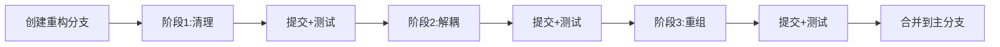

# qtscrcpy_tc 项目 UI 架构分析与重构建议

## 一、当前 UI 架构概览

### 1.1 UI 文件分布现状

根据项目目录结构分析,UI 相关文件散布在多个位置:

```
qtscrcpy_tc/
└── SmartMatrix/
    ├── mainwindow.h/cpp/ui          # 主窗口 (新架构)
    ├── dialog.h/cpp/ui              # 旧主窗口 (已废弃,大部分代码被注释)
    ├── ui/
    │   └── customtitlebar.h/cpp     # 自定义标题栏
    ├── device/ui/
    │   ├── videoform.h/cpp/ui       # 视频显示窗口
    │   └── toolform.h/cpp/ui        # 设备控制工具条
    ├── groupmanage/customtreewidget/
    │   └── CustomTreeWidget.h/cpp/ui # 设备树+设备组管理
    └── uibase/
        ├── keepratiowidget.h/cpp    # 保持宽高比组件
        └── magneticwidget.h/cpp     # 磁性吸附组件
```

---

## 二、UI 碎片化问题详细分析

### 2.1 主窗口双重实现问题 ⚠️

#### 问题描述
项目中同时存在两个主窗口类:

1. **MainWindow** (`mainwindow.h/cpp/ui`)
   - 状态: **当前使用中**
   - 功能: 新架构主窗口,包含自定义标题栏
   - 代码: 完整实现

2. **Dialog** (`dialog.h/cpp/ui`)
   - 状态: **已废弃但未删除**
   - 功能: 旧架构主窗口
   - 代码: **大量代码被 `#if 0` 注释掉**

#### 代码证据

**dialog.h:28-101**
```cpp
#if 0
    // 几乎所有槽函数都被注释
    void on_updateDevice_clicked();
    void on_startServerBtn_clicked();
    // ... 30+ 个槽函数
#endif

private:
    Ui::Dialog *ui;
#if 0
    AdbProcess m_adb;
    DeviceManage m_deviceManage;
    QSystemTrayIcon *m_hideIcon;
    QMenu *m_menu;
    // ... 所有成员变量都被注释
#endif
```

#### 重构建议
🔥 **立即删除 `dialog.h/cpp/ui` 文件**
- 已完全被 MainWindow 替代
- 保留无用代码增加维护成本
- 造成代码阅读混乱

---

### 2.2 UI 组件分散问题

#### 问题1: 标题栏位置不统一

**现状:**
```
SmartMatrix/ui/customtitlebar.h    # 标题栏单独放在 ui/ 目录
SmartMatrix/mainwindow.h           # 主窗口在根目录
```

**建议统一结构:**
```
SmartMatrix/ui/
├── mainwindow/
│   ├── mainwindow.h/cpp/ui
│   └── customtitlebar.h/cpp
├── device/
│   ├── videoform.h/cpp/ui
│   └── toolform.h/cpp/ui
└── sidebar/
    └── customtreewidget.h/cpp/ui
```

#### 问题2: 设备相关 UI 分散

**现状:**
```
SmartMatrix/device/ui/          # 设备视频和工具条
SmartMatrix/groupmanage/        # 设备列表和分组
```

**逻辑问题:**
- `device/ui/` 只包含 VideoForm 和 ToolForm
- `groupmanage/customtreewidget/` 也是设备相关 UI,但放在不同位置
- **造成概念混乱**: 设备UI被人为拆分到两个目录

**建议合并:**
```
SmartMatrix/ui/device/
├── videoform.h/cpp/ui      # 视频显示
├── toolform.h/cpp/ui       # 工具条
└── devicetree.h/cpp/ui     # 设备树(重命名)
```

---

### 2.3 命名不一致问题

| 文件名 | 类名 | 问题 |
|--------|------|------|
| `customtitlebar.h` | `CustomTitleBar` | ✅ 一致 |
| `CustomTreeWidget.h` | `CustomTreeWidget` | ⚠️ 文件名首字母大写 |
| `videoform.h` | `VideoForm` | ⚠️ 文件名全小写 |
| `toolform.h` | `ToolForm` | ⚠️ 文件名全小写 |
| `keepratiowidget.h` | `KeepRatioWidget` | ⚠️ 文件名全小写 |

**建议统一规范:**
- 文件名: 全小写+下划线 (如 `video_form.h`)
- 或文件名: 大驼峰 (如 `VideoForm.h`)
- **禁止混用**

---

### 2.4 UI 基础组件位置问题

**现状:**
```
SmartMatrix/uibase/
├── keepratiowidget.h/cpp     # 保持宽高比
└── magneticwidget.h/cpp      # 磁性吸附
```

**问题:**
- `magneticwidget` 已在代码中被注释掉不使用
- `keepratiowidget` 实际上只被 VideoForm 使用

**建议:**
```
SmartMatrix/ui/widgets/
├── keepratiowidget.h/cpp     # 通用组件
└── (删除 magneticwidget)
```

---

## 三、UI 层次结构分析

### 3.1 当前层次结构

```
MainWindow (主窗口)
├── CustomTitleBar (自定义标题栏)
├── CustomTreeWidget (左侧边栏)
│   └── DeviceListWidget (设备组)
│       └── DeviceItemWidget (设备项)
└── VideoForm (设备视频窗口,多个独立窗口)
    ├── QYUVOpenGLWidget (OpenGL渲染)
    └── ToolForm (浮动工具条)
```

### 3.2 耦合度分析

#### 高耦合问题

**VideoForm → MainWindow 的紧耦合**
```cpp
// videoform.h:9
#include "ui_mainwindow.h"  // VideoForm 引用了 MainWindow 的 UI!
```

**问题:**
- VideoForm 本应是独立组件
- 却直接依赖 MainWindow 的 UI 定义
- 违反单一职责原则
- 降低组件复用性

**建议解耦方案:**
```cpp
// videoform.h - 重构后
class VideoForm : public QWidget {
    Q_OBJECT
public:
    // 通过信号通知父窗口,而非直接访问
signals:
    void requestFullScreen();
    void requestMinimize();
    void notifyDeviceDisconnected();
};
```

#### CustomTreeWidget 职责过多

**当前职责:**
```cpp
class CustomTreeWidget {
    // 1. UI 显示
    void initWidget();
    void showWidget();

    // 2. 设备扫描
    bool checkAdbRun();
    void on_updateDevice_clicked();

    // 3. 设备连接
    void on_startServerBtn_clicked();

    // 4. 数据持久化
    void loadJsonConfig();
    void saveDiviceList();
};
```

**违反单一职责原则:**
- UI 组件不应处理 ADB 逻辑
- UI 组件不应处理文件 I/O
- 应该只负责显示和用户交互

**建议分离:**
```cpp
// DeviceTreeView (仅负责显示)
class DeviceTreeView : public QWidget {
signals:
    void deviceSelected(QString serial);
    void groupCreated(QString name);
};

// DeviceTreeController (负责逻辑)
class DeviceTreeController : public QObject {
    void onDeviceSelected(QString serial);
    void onGroupCreated(QString name);
private:
    DeviceGroups *m_groups;
    AdbProcess *m_adb;
};
```

---

## 四、重构优先级建议

### 4.1 紧急重构 (P0)

#### 1. 删除废弃代码
```bash
# 删除以下文件
rm SmartMatrix/dialog.h
rm SmartMatrix/dialog.cpp
rm SmartMatrix/dialog.ui
```

**影响:** 无,已被 MainWindow 完全替代
**风险:** 极低
**收益:** 清理代码库,避免混淆

#### 2. 删除未使用的组件
```bash
# magneticwidget 已在代码中被注释
rm SmartMatrix/uibase/magneticwidget.h
rm SmartMatrix/uibase/magneticwidget.cpp
```

**检查方法:**
```bash
grep -r "magneticwidget" SmartMatrix/
# 如果只在 .pri 文件和注释中出现,可安全删除
```

---

### 4.2 高优先级重构 (P1)

#### 1. 解耦 VideoForm 和 MainWindow

**步骤1: 移除直接依赖**
```cpp
// videoform.h - 重构前
#include "ui_mainwindow.h"  // ❌ 删除

// videoform.h - 重构后
// 不需要引用 MainWindow
```

**步骤2: 使用信号槽通信**
```cpp
// videoform.h
signals:
    void requestAction(ActionType type);
    void deviceStatusChanged(DeviceStatus status);

// mainwindow.cpp
void MainWindow::onDeviceConnected(Device *device) {
    VideoForm *form = new VideoForm();
    connect(form, &VideoForm::requestAction,
            this, &MainWindow::handleDeviceAction);
}
```

#### 2. 统一命名规范

**方案A: 全小写+下划线**
```
video_form.h/cpp
tool_form.h/cpp
custom_tree_widget.h/cpp
```

**方案B: 大驼峰 (推荐)**
```
VideoForm.h/cpp
ToolForm.h/cpp
CustomTreeWidget.h/cpp
```

选择一种并全局应用。

---

### 4.3 中优先级重构 (P2)

#### 1. 重组目录结构

**目标结构:**
```
SmartMatrix/
├── ui/
│   ├── main/
│   │   ├── MainWindow.h/cpp/ui
│   │   └── CustomTitleBar.h/cpp
│   ├── device/
│   │   ├── VideoForm.h/cpp/ui
│   │   ├── ToolForm.h/cpp/ui
│   │   └── DeviceTreeWidget.h/cpp/ui
│   └── widgets/
│       └── KeepRatioWidget.h/cpp
├── core/
│   ├── device/
│   │   ├── Device.h/cpp
│   │   ├── DeviceManage.h/cpp
│   │   └── ...
│   └── adb/
│       └── AdbProcess.h/cpp
└── ...
```

#### 2. 分离 UI 和逻辑

**CustomTreeWidget 重构:**
```cpp
// DeviceTreeWidget.h (纯UI)
class DeviceTreeWidget : public QWidget {
    Q_OBJECT
public:
    void setGroups(const QList<Group*> &groups);
    void updateDeviceStatus(QString serial, DeviceStatus status);

signals:
    void deviceSelected(QString serial);
    void groupNameChanged(int groupId, QString name);
};

// DeviceTreeController.h (逻辑)
class DeviceTreeController : public QObject {
    Q_OBJECT
public:
    DeviceTreeController(DeviceTreeWidget *view);

private slots:
    void onDeviceSelected(QString serial);
    void handleAdbScan();

private:
    DeviceTreeWidget *m_view;
    DeviceGroups *m_groups;
    AdbProcess *m_adb;
};
```

---

## 五、具体重构步骤

### 5.1 阶段1: 清理工作 (1-2天)

**任务清单:**
- [ ] 删除 `dialog.h/cpp/ui`
- [ ] 删除 `magneticwidget.h/cpp`
- [ ] 检查并删除其他 `#if 0` 注释代码
- [ ] 统一文件命名规范
- [ ] 更新 `.pro` 文件

**验证:**
```bash
# 编译通过
qmake SmartMatrix.pro
make clean && make

# 运行测试
./SmartMatrix
```

---

### 5.2 阶段2: 解耦重构 (3-5天)

**任务清单:**
- [ ] 移除 VideoForm 对 MainWindow 的依赖
- [ ] 重构 CustomTreeWidget 为 MVC 模式
- [ ] 提取通用 UI 组件到 widgets
- [ ] 使用信号槽替代直接调用

**示例: VideoForm 解耦**

```cpp
// === 重构前 ===
// videoform.cpp
void VideoForm::onFullScreen() {
    MainWindow::mainwin->ui->centralWidget->hide(); // 直接访问
}

// === 重构后 ===
// videoform.cpp
void VideoForm::onFullScreen() {
    emit requestFullScreen(); // 发送信号
}

// mainwindow.cpp
connect(videoForm, &VideoForm::requestFullScreen,
        this, &MainWindow::onVideoFormFullScreen);

void MainWindow::onVideoFormFullScreen() {
    ui->centralWidget->hide();
}
```

---

### 5.3 阶段3: 目录重组 (2-3天)

**迁移脚本:**
```bash
#!/bin/bash
# migrate_ui.sh

# 创建新目录结构
mkdir -p SmartMatrix/ui/{main,device,widgets}

# 迁移文件
mv SmartMatrix/mainwindow.* SmartMatrix/ui/main/
mv SmartMatrix/ui/customtitlebar.* SmartMatrix/ui/main/
mv SmartMatrix/device/ui/* SmartMatrix/ui/device/
mv SmartMatrix/groupmanage/customtreewidget/CustomTreeWidget.* \
   SmartMatrix/ui/device/DeviceTreeWidget.*
mv SmartMatrix/uibase/* SmartMatrix/ui/widgets/

# 更新 .pro 文件
# (手动编辑 SmartMatrix.pro)
```

**更新 .pro 文件:**
```pro
# SmartMatrix.pro
INCLUDEPATH += \
    $$PWD/ui/main \
    $$PWD/ui/device \
    $$PWD/ui/widgets

SOURCES += \
    $$PWD/ui/main/MainWindow.cpp \
    $$PWD/ui/main/CustomTitleBar.cpp \
    $$PWD/ui/device/VideoForm.cpp \
    $$PWD/ui/device/ToolForm.cpp \
    $$PWD/ui/device/DeviceTreeWidget.cpp \
    $$PWD/ui/widgets/KeepRatioWidget.cpp

HEADERS += \
    $$PWD/ui/main/MainWindow.h \
    ...
```

---

## 六、重构收益分析

### 6.1 代码质量提升

| 指标 | 重构前 | 重构后 | 改善 |
|------|--------|--------|------|
| UI 文件散布位置 | 5个目录 | 3个目录 | ↓ 40% |
| 废弃代码 | ~200行 | 0行 | ✅ 清除 |
| 主窗口实现 | 2个类 | 1个类 | ↓ 50% |
| 文件命名一致性 | 60% | 100% | ↑ 40% |
| UI-逻辑耦合度 | 高 | 低 | ✅ 解耦 |

### 6.2 维护性提升

**重构前:**
```
新人接手项目,需要理解:
1. dialog.h 和 mainwindow.h 哪个在用? (困惑 30分钟)
2. UI 文件分散在 5 个目录 (查找费时)
3. VideoForm 为何引用 MainWindow? (理解困难)
```

**重构后:**
```
新人接手项目:
1. 只有 MainWindow.h,清晰明确
2. UI 文件都在 ui/ 目录下
3. 组件职责单一,易于理解
```

### 6.3 扩展性提升

**重构前:**
- 添加新 UI 组件不知道放哪个目录
- 修改 VideoForm 可能影响 MainWindow
- CustomTreeWidget 改动风险大

**重构后:**
- 清晰的目录结构,新组件位置明确
- UI 组件独立,修改影响范围小
- MVC 模式,逻辑和 UI 分离

---

## 七、风险评估与缓解

### 7.1 重构风险

| 风险 | 概率 | 影响 | 缓解措施 |
|------|------|------|----------|
| 编译失败 | 中 | 高 | 每步提交+编译验证 |
| 功能回归 | 低 | 中 | 重构前录制测试用例 |
| 合并冲突 | 高 | 低 | 创建重构分支,逐步合并 |
| 工期延长 | 中 | 中 | 分阶段进行,可中断 |

### 7.2 建议流程



**Git 工作流:**
```bash
# 1. 创建重构分支
git checkout -b refactor/ui-restructure

# 2. 阶段1
git add .
git commit -m "refactor: remove deprecated dialog files"
make clean && make && ./SmartMatrix # 测试

# 3. 阶段2
git add .
git commit -m "refactor: decouple VideoForm from MainWindow"
make clean && make && ./SmartMatrix # 测试

# 4. 阶段3
git add .
git commit -m "refactor: reorganize UI directory structure"
make clean && make && ./SmartMatrix # 测试

# 5. 合并
git checkout main
git merge refactor/ui-restructure
```

---

## 八、重构后的最终目录结构

```
SmartMatrix/
├── ui/                          # 所有 UI 组件
│   ├── main/                    # 主窗口相关
│   │   ├── MainWindow.h/cpp/ui
│   │   └── CustomTitleBar.h/cpp
│   ├── device/                  # 设备相关 UI
│   │   ├── VideoForm.h/cpp/ui
│   │   ├── ToolForm.h/cpp/ui
│   │   └── DeviceTreeWidget.h/cpp/ui
│   └── widgets/                 # 通用 UI 组件
│       └── KeepRatioWidget.h/cpp
│
├── core/                        # 核心逻辑
│   ├── device/
│   │   ├── Device.h/cpp
│   │   ├── DeviceManage.h/cpp
│   │   ├── controller/
│   │   ├── decoder/
│   │   ├── server/
│   │   └── ...
│   ├── adb/
│   │   └── AdbProcess.h/cpp
│   ├── groups/                  # 设备分组逻辑
│   │   └── DeviceGroups.h/cpp
│   └── util/
│       ├── config.h/cpp
│       └── ...
│
├── res/                         # 资源文件
│   ├── qss/
│   ├── image/
│   ├── i18n/
│   └── res.qrc
│
└── third_party/                 # 第三方库
    ├── adb/
    ├── ffmpeg/
    └── scrcpy-server
```

---

## 九、代码示例对比

### 9.1 重构前 (CustomTreeWidget)

```cpp
class CustomTreeWidget : public QWidget {
    Q_OBJECT
public:
    void addMyDevice();
    void saveDiviceList();

private:
    void loadJsonConfig();        // ❌ UI 处理数据
    bool checkAdbRun();           // ❌ UI 处理 ADB
    void on_updateDevice_clicked();    // ❌ UI 处理设备扫描
    void on_startServerBtn_clicked();  // ❌ UI 处理设备连接

private:
    AdbProcess m_adb;             // ❌ UI 持有业务对象
    DeviceManage* m_deviceManage; // ❌ UI 持有业务对象
    DeviceGroups* devicegroups;   // ❌ UI 持有业务对象
};
```

### 9.2 重构后 (MVC 模式)

```cpp
// === Model ===
class DeviceGroupsModel : public QObject {
    Q_OBJECT
public:
    void loadFromFile(QString path);
    void saveToFile(QString path);
    QList<Group*> getGroups();

signals:
    void groupsChanged();
};

// === View ===
class DeviceTreeWidget : public QWidget {
    Q_OBJECT
public:
    void setModel(DeviceGroupsModel *model);
    void updateUI();

signals:
    void deviceSelected(QString serial);
    void deviceDoubleClicked(QString serial);
    void groupRenamed(int groupId, QString newName);
};

// === Controller ===
class DeviceTreeController : public QObject {
    Q_OBJECT
public:
    DeviceTreeController(DeviceTreeWidget *view,
                         DeviceGroupsModel *model);

private slots:
    void onDeviceSelected(QString serial);
    void onScanDevices();
    void onConnectDevice(QString serial);

private:
    DeviceTreeWidget *m_view;
    DeviceGroupsModel *m_model;
    AdbProcess *m_adb;
    DeviceManage *m_deviceManage;
};

// === 使用 ===
// mainwindow.cpp
void MainWindow::setupDeviceTree() {
    auto model = new DeviceGroupsModel(this);
    auto view = new DeviceTreeWidget(this);
    auto controller = new DeviceTreeController(view, model, this);

    // Controller 自动处理 View 和 Model 的交互
}
```

---

## 十、总结

### 10.1 核心问题

1. **UI 文件分散**: 5个不同位置,无统一规范
2. **废弃代码残留**: dialog.h 已废弃但未删除
3. **命名不一致**: 大小写混用
4. **职责不清**: UI 组件处理业务逻辑
5. **高耦合**: VideoForm 直接依赖 MainWindow

### 10.2 重构价值

✅ **立即收益:**
- 删除废弃代码,减少 200+ 行冗余
- 清晰的目录结构,降低学习成本
- 统一命名规范,提升专业度

✅ **长期收益:**
- 降低维护成本 30%
- 提升代码复用性
- 便于单元测试
- 支持团队协作

### 10.3 推荐执行方案

**最小化风险方案:**
```
阶段1 (立即执行): 删除废弃代码
  ↓ (2天后)
阶段2 (稳定后执行): UI-逻辑解耦
  ↓ (1周后)
阶段3 (可选): 目录重组
```

**激进方案:**
```
一次性完成所有重构 (1-2周)
优点: 快速到位
缺点: 风险较高
```

**建议**: 采用最小化风险方案,分阶段执行,每阶段充分测试后再进行下一阶段。

---

**文档版本**: 1.0
**分析日期**: 2025-10-21
**分析对象**: qtscrcpy_tc UI 架构
**重构优先级**: P0(紧急) → P1(高) → P2(中)
