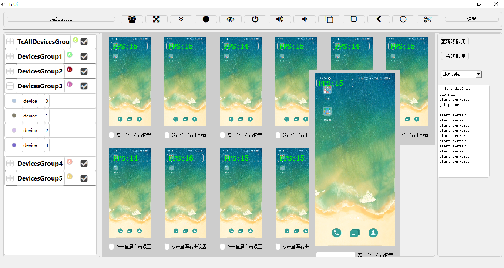
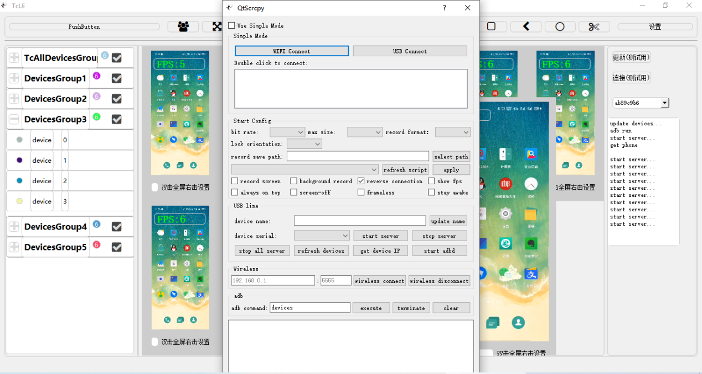

# 安卓手机投屏、电脑录屏、电脑控制、按键映射、手机群控  

---

|作者|日期|
|---|---|
|将狼才鲸|2021-11-28|

---

## 编译要求

### 当前版本 (已升级到 Qt 6.9)
* **Qt 6.9** + MSVC 2019/2022 64-bit (Windows) 或 GCC 8+ (Linux) 或 Clang (macOS)
* **C++17** 标准支持
* 源码在 QtScrcpy 的基础上进行修改和添加
* 参考：https://gitee.com/Barryda/QtScrcpy/

### 编译方法
推荐使用 `scripts/` 目录下的自动化编译脚本：

**Windows:**
```cmd
cd scripts
build-windows.bat release
deploy-windows.bat release
```

**Linux:**
```bash
cd scripts
./build-linux.sh release
```

**macOS:**
```bash
cd scripts
./build-macos.sh release
```

详细说明请查看 `scripts/README.md`

### 历史版本说明 (已废弃)
* ~~不能直接用最新的Qt（编译会报错，如果用过Qt可以尝试自己解决，只是UTF-8相关的编译报错），我用的是5.15.2 + MSVC2017 64bit~~
- ~~曾经用过最新的版本，Qt6.2.1/Qt6.2.0有multimedia模块的bug，比如QAudioFormat对PCM音频的播放就还不支持，这个bug在Qt6.2.0.alpha中被修正了，但是在正式版中还没发布（2021-11-28）~~
- ~~更新Qt6.1.3时有报错"error during installation process(qt.qt6.613.win64_msvc2019_64):"~~
- ~~安装Qt6.0.4后又发现没有multimedia模块~~
- ~~重新换成了Qt5.15.2版本~~

**注意：** 以上问题在 Qt 6.9 中已全部解决，项目已成功升级到 Qt 6.9  

## 运行效果  
* 见主目录下的png图片  
  
  

## 发布流程

### 自动化发布（推荐）
使用 `scripts/deploy-windows.bat` 脚本自动打包所有依赖：

```cmd
cd scripts
deploy-windows.bat release
```

脚本会自动完成：
1. 运行 `windeployqt` 收集 Qt 依赖库
2. 复制 FFmpeg DLLs
3. 复制 ADB 工具
4. 复制 scrcpy-server
5. 复制配置文件和按键映射
6. 生成 README.txt

打包后的文件位于 `deploy/win/x64/release/` 目录，可直接分发。

### 手动发布（传统方法）
* 打开 Win10 开始菜单中的 "Qt 6.9.0 (MSVC 2019 64-bit)" 命令行工具
* 使用 `windeployqt` 命令收集依赖库：
  ```cmd
  windeployqt 17_TcUi.exe
  ```
* 手动复制以下文件到发布目录：
  - `third_party/scrcpy-server/`
  - `third_party/ffmpeg/bin/x64/*.dll`
  - `third_party/adb/win/` 下的所有 ADB 文件
  - `config/` 配置文件
  - `keymap/` 按键映射文件

### 参考资料
* Qt 6 部署文档：https://doc.qt.io/qt-6/windows-deployment.html
* 原 QtScrcpy 项目：https://gitee.com/Barryda/QtScrcpy/  
