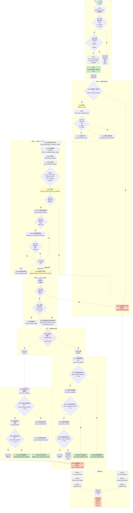

# 辅助功能流程（Mermaid 版）

```mermaid
%%{init: {'themeVariables': {'fontSize': '45px', 'primaryFontSize': '45px', 'secondaryFontSize': '45px', 'tertiaryFontSize': '45px', 'fontFamily': 'arial'}}}%%
flowchart TB
    subgraph Entry["入口 - 热键触发"]
        H1_Hotkey["[H1] 热键 F3 按下"]
        H2_Callback["[H2] assistant_hotkey 回调触发"]
        H3_CheckRunning{"[H3] 检查是否已在运行<br/>is_running == True?"}
        H4_CheckEnabled{"[H4] 检查是否已禁用<br/>enabled == False?"}
        H5_CanStart["[H5] can_start_assistant<br/>not running AND enabled"]
        H6_AlreadyRunning["[H6] 已在运行或已禁用<br/>返回 False"]
        H7_SetRunning["[H7] set_assistant_running True"]
        H8_PrintStart["[H8] 打印启动信息"]
        H1_Hotkey --> H2_Callback
        H2_Callback --> H3_CheckRunning
        H3_CheckRunning -->|"是"| H6_AlreadyRunning
        H3_CheckRunning -->|"否"| H4_CheckEnabled
        H4_CheckEnabled -->|"是"| H6_AlreadyRunning
        H4_CheckEnabled -->|"否"| H5_CanStart
        H5_CanStart --> H7_SetRunning
        H7_SetRunning --> H8_PrintStart
    end

    subgraph Step1["步骤 1 - 捕获游戏窗口"]
        S1_CheckStop1{"[S1s] 检查用户是否停止<br/>should_stop_assistant?"}
        S1_CallCapture["[S1] 调用 collect_ui_info"]
        S1_ForceCapture["[S1f] force_new_capture=True"]
        S1_GetRegion{"[S1r] 获取 UI 区域<br/>ui_region != None?"}
        S1_Failed["[S1x] 捕获失败<br/>reset_assistant_state"]
        H8_PrintStart --> S1_CheckStop1
        S1_CheckStop1 -->|"是"| RS_ResetEarly
        S1_CheckStop1 -->|"否"| S1_CallCapture
        S1_CallCapture --> S1_ForceCapture
        S1_ForceCapture --> S1_GetRegion
        S1_GetRegion -->|"否"| S1_Failed
        S1_GetRegion -->|"是"| S2_GetData
    end

    subgraph Step2["步骤 2 - 从图片检测界面"]
        S2_GetData["[S2] 获取共享数据<br/>get_game_interface_data"]
        S2_GetImage["[S2i] 获取全窗口图片<br/>shared_data.game_window_image"]
        S2_GetConfig["[S2c] 获取配置<br/>CONFIG macro_configs.auxiliary_config"]
        S2_CheckBlacksmith["[S2b1] 检查 blacksmith.enabled"]
        S2_CheckAutoSalvage["[S2b2] 检查 auto_salvage.enabled"]
        S2_WantBlacksmith{"[S2b3] want_blacksmith?<br/>blacksmith OR auto_salvage enabled"}
        S2_CallDetect["[S2d] 调用 detect_interface_from_full_window"]
        S2_CheckStop2{"[S2s] 检查用户是否停止"}
        S2_MatchBlacksmith["[S2mb] 匹配铁匠模板<br/>bag_opened_indicator"]
        S2_CheckLeft30_BS{"[S2mb2] 匹配中心在左 30% 内?"}
        S2_MatchKanai["[S2mk] 匹配魔盒模板<br/>kanai_cube_left_panel_indicator"]
        S2_CheckLeft30_KC{"[S2mk2] 匹配中心在左 30% 内?"}
        S2_Result{"[S2r] 检测结果"}
        S2_NotFound["[S2f] 未检测到界面<br/>reset_assistant_state"]
        S1_GetRegion --> S2_GetData
        S2_GetData --> S2_GetImage
        S2_GetImage --> S2_GetConfig
        S2_GetConfig --> S2_CheckBlacksmith
        S2_CheckBlacksmith --> S2_CheckAutoSalvage
        S2_CheckAutoSalvage --> S2_WantBlacksmith
        S2_WantBlacksmith --> S2_CallDetect
        S2_CallDetect --> S2_CheckStop2
        S2_CheckStop2 -->|"是"| RS_ResetEarly
        S2_CheckStop2 -->|"否"| S2_MatchBlacksmith
        S2_MatchBlacksmith --> S2_CheckLeft30_BS
        S2_CheckLeft30_BS -->|"是"| S2_Result
        S2_CheckLeft30_BS -->|"否"| S2_MatchKanai
        S2_MatchKanai --> S2_CheckLeft30_KC
        S2_CheckLeft30_KC -->|"是"| S2_Result
        S2_CheckLeft30_KC -->|"否"| S2_Result
        S2_Result -->|"None"| S2_NotFound
        S2_Result -->|"blacksmith"| S3_Collect
        S2_Result -->|"kanai_cube"| S3_Collect
    end

    subgraph Step3["步骤 3 - 收集背包信息"]
        S3_Collect["[S3] 收集背包信息<br/>collect_bag_info_from_current_shared"]
        S3_NoSecondCapture["[S3n] 不进行第二次截图"]
        S3_CheckStop3{"[S3s] 检查用户是否停止"}
        S3_GetCoords{"[S3c] 获取背包坐标<br/>bag_coords != None?"}
        S3_Failed["[S3f] 收集失败<br/>reset_assistant_state"]
        S2_Result --> S3_Collect
        S3_Collect --> S3_NoSecondCapture
        S3_NoSecondCapture --> S3_CheckStop3
        S3_CheckStop3 -->|"是"| RS_ResetEarly
        S3_CheckStop3 -->|"否"| S3_GetCoords
        S3_GetCoords -->|"否"| S3_Failed
        S3_GetCoords -->|"是"| BR_GetResolvedType
    end

    subgraph Branch["分支 - 界面类型决策"]
        BR_GetResolvedType["[BR] 获取解析后的界面类型<br/>shared_data.interface_type OR interface_type"]
        BR_CheckKanai{"[BRk] 是否为魔盒？<br/>resolved_type == kanai_cube"}
        BR_Kanai["[BRka] 魔盒分支"]
        BR_Blacksmith["[BRb] 铁匠分支"]
        S3_GetCoords --> BR_GetResolvedType
        BR_GetResolvedType --> BR_CheckKanai
        BR_CheckKanai -->|"是"| BR_Kanai
        BR_CheckKanai -->|"否"| BR_Blacksmith
    end

    subgraph Kanai["魔盒流程"]
        K1_GetReforgeConfig["[K1] 获取重铸配置<br/>aux.kanai_reforge"]
        K1_CheckReforge{"[K1c] 重铸是否启用？<br/>kanai_reforge.enabled == True"}
        K2_GetUpgradeConfig["[K2] 获取升级配置<br/>aux.kanai_upgrade"]
        K2_CheckUpgrade{"[K2c] 升级是否启用？<br/>kanai_upgrade.enabled == True"}
        K3_GetConvertConfig["[K3] 获取转换配置<br/>aux.kanai_convert"]
        K3_CheckConvert{"[K3c] 转换是否启用？<br/>kanai_convert.enabled == True"}
        K4_RunReforge["[K4] 执行重铸流程<br/>run_kanai_reforge_flow"]
        K5_RunUpgrade["[K5] 执行升级流程<br/>run_kanai_upgrade_flow"]
        K6_RunConvert["[K6] 执行转换流程<br/>TODO: 未实现"]
        K7_NoFunction["[K7] 无功能启用"]
        BR_Kanai --> K1_GetReforgeConfig
        K1_GetReforgeConfig --> K1_CheckReforge
        K1_CheckReforge -->|"是"| K4_RunReforge
        K1_CheckReforge -->|"否"| K2_GetUpgradeConfig
        K2_GetUpgradeConfig --> K2_CheckUpgrade
        K2_CheckUpgrade -->|"是"| K5_RunUpgrade
        K2_CheckUpgrade -->|"否"| K3_GetConvertConfig
        K3_GetConvertConfig --> K3_CheckConvert
        K3_CheckConvert -->|"是"| K6_RunConvert
        K3_CheckConvert -->|"否"| K7_NoFunction
        K4_RunReforge --> RS_Reset
        K5_RunUpgrade --> RS_Reset
        K6_RunConvert --> RS_Reset
        K7_NoFunction --> RS_Reset
    end

    subgraph Blacksmith["铁匠流程"]
        B1_GetAutoSalvageConfig["[B1] 获取自动分解配置<br/>aux.auto_salvage"]
        B1_CheckAutoSalvage{"[B1c] 自动分解是否启用？<br/>auto_salvage.enabled == True"}
        B2_GetKeep["[B2] 获取保留规则<br/>auto_salvage.keep"]
        B2_GetDebugOnly["[B2d] 获取调试模式<br/>auto_salvage.debug_only"]
        B3_RunAutoSalvage["[B3] 执行自动分解<br/>handle_auto_salvage_by_slots"]
        B4_GetBlacksmithConfig["[B4] 获取铁匠配置<br/>aux.blacksmith"]
        B4_CheckBlacksmith{"[B4c] 铁匠是否启用？<br/>blacksmith.enabled == True"}
        B5_RunSalvage["[B5] 执行拆解操作<br/>handle_blacksmith_upgrade"]
        B6_NoFunction["[B6] 无功能启用"]
        BR_Blacksmith --> B1_GetAutoSalvageConfig
        B1_GetAutoSalvageConfig --> B1_CheckAutoSalvage
        B1_CheckAutoSalvage -->|"是"| B2_GetKeep
        B2_GetKeep --> B2_GetDebugOnly
        B2_GetDebugOnly --> B3_RunAutoSalvage
        B1_CheckAutoSalvage -->|"否"| B4_GetBlacksmithConfig
        B4_GetBlacksmithConfig --> B4_CheckBlacksmith
        B4_CheckBlacksmith -->|"是"| B5_RunSalvage
        B4_CheckBlacksmith -->|"否"| B6_NoFunction
        B3_RunAutoSalvage --> RS_Reset
        B5_RunSalvage --> RS_Reset
        B6_NoFunction --> RS_Reset
    end

    subgraph Reset["重置状态"]
        RS_ResetEarly["[RS1] 重置状态（提前退出）<br/>reset_assistant_state"]
        RS_SetRunningFalse["[RS1a] is_running=False"]
        RS_SetStopFalse["[RS1b] should_stop=False"]
        RS_SetEnabledTrue["[RS1c] enabled=True"]
        RS_Reset["[RS2] 重置状态（正常退出）<br/>reset_assistant_state"]
        RS_SetRunningFalse2["[RS2a] is_running=False"]
        RS_SetStopFalse2["[RS2b] should_stop=False"]
        RS_SetEnabledTrue2["[RS2c] enabled=True"]
        RS_PrintFinish["[RS3] 打印完成信息"]
        RS_Return["[RS4] 返回结果<br/>Return True or False"]
        RS_ResetEarly --> RS_SetRunningFalse
        RS_SetRunningFalse --> RS_SetStopFalse
        RS_SetStopFalse --> RS_SetEnabledTrue
        RS_SetEnabledTrue --> RS_PrintFinish
        RS_Reset --> RS_SetRunningFalse2
        RS_SetRunningFalse2 --> RS_SetStopFalse2
        RS_SetStopFalse2 --> RS_SetEnabledTrue2
        RS_SetEnabledTrue2 --> RS_PrintFinish
        RS_PrintFinish --> RS_Return
    end

    style H1_Hotkey fill:#e1f5ff
    style H7_SetRunning fill:#c8e6c9
    style S1_CallCapture fill:#fff9c4
    style S2_CallDetect fill:#fff9c4
    style S3_Collect fill:#fff9c4
    style BR_CheckKanai fill:#f3e5f5
    style K4_RunReforge fill:#c8e6c9
    style K5_RunUpgrade fill:#c8e6c9
    style B3_RunAutoSalvage fill:#c8e6c9
    style B5_RunSalvage fill:#c8e6c9
    style RS_Reset fill:#ffccbc
    style RS_ResetEarly fill:#ffccbc
    style RS_Return fill:#ffccbc
```
