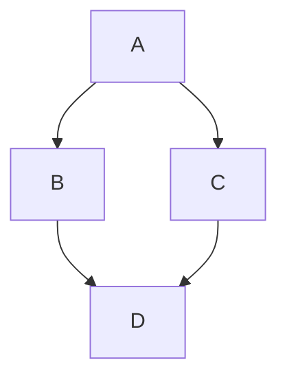

# Mermaid 使用规范（Markdown Preview Mermaid Support）

本规范基于 **Markdown Preview Mermaid Support** 扩展与 **Mermaid 11.12.0**。在项目内编写或审阅含 Mermaid 图的 Markdown 文档时须遵守。

---

## 用法

- **Fenced code blocks**：使用 ` ```mermaid ` 围栏代码块包裹 Mermaid 源码。
- **替代写法**：可使用 `::: mermaid` … `:::` 块（部分渲染器支持）。

示例：



---

## 配置（VS Code）

| 配置项 | 说明 |
|--------|------|
| `markdown-mermaid.lightModeTheme` | 浅色主题下 Mermaid 主题。可选：`base`、`forest`、`dark`、`default`、`neutral`。 |
| `markdown-mermaid.darkModeTheme` | 深色主题下 Mermaid 主题。可选同上。 |
| `markdown-mermaid.languages` | Mermaid 代码块的语言 ID，默认 `["mermaid"]`。 |

---

## 自定义样式（Markdown 预览）

可通过 `markdown.styles` 为 Markdown 预览注入自定义 CSS，详见 [markdown.styles 文档](https://code.visualstudio.com/docs/languages/markdown#_markdown-preview-styles)。例如引入 Font Awesome 后，可在图中使用 `fa:fa-check` 等图标。

---

## 书写约定（流程图）

- 流程图统一使用 **flowchart TB**（自上而下），与 `graph TD` 等价，便于与扩展及 Mermaid 11.x 兼容。
- 节点文案含特殊字符时放在双引号内，如 `["节点文本"]`；分支标签用 `-->|标签|`。
- 不依赖扩展特有语法（如 architecture-beta、MDI/Iconify）以保证在 GitHub 等环境可渲染。
