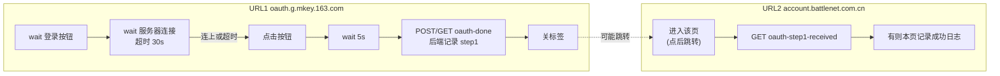

# ROSBOT 启动流程（Mermaid 版）

本文档为 `ROSBOT_FLOW.md` 的 Mermaid 图版本，流程与约定与原文一致。**全部流程合并为一张 Mermaid 图**，规范见：[`MERMAID_SPEC.md`](MERMAID_SPEC.md)。可在 VS Code 内置 Markdown 预览（Markdown Preview Mermaid Support 扩展）、GitHub、Typora 等支持 Mermaid 的查看器中渲染。

---

## 全流程（单图合并）

下图包含：入口与定时器、战网就绪检查、D3 是否在线、是否有 D3 进程、分支 A（片段 1/片段 2）、分支 B（从战网启动 D3 至启动后自动化）、主线程收尾。本流程为 tick 驱动，掉线后自动回到流程开始。

```mermaid
flowchart TB
    Start["[A1] 用户点击「启动 ROSBOT」→ 设置总状态（开启）；更新 UI 为「运行中」"]
    Stop["用户点击「停止」→ 关闭总状态；此后全局定时器跳过所有分支"]
    Start --> Timer["[A2] 全局定时器 1 秒一跳；本流程 % 实现 2 秒一个 tick。总状态关闭 → 跳过所有分支；总状态开启 → 按当前分支状态驱动（wait → 本 tick 跳过，有导向 → 执行并切换）"]
    Timer --> Tick{"[A3] 总状态开启且本 tick 有导向？"}
    Tick -->|否| Skip["跳过所有分支"]
    Tick -->|是| BN_Entry["[B1] 战网就绪检查入口"]

    subgraph B["B"]
        BN_Entry --> BN_Win{"[B2] 当前是否有战网窗口？"}
        BN_Win -->|无| BN_Start["[B3] 启动战网 → 等待数秒"]
        BN_Win -->|有| BN_FirstQ1{"[B4] 首界面：登陆页？"}
        BN_FirstQ1 -->|是| BN_Exit["[B5] 退出战网"]
        BN_FirstQ1 -->|否| BN_FirstQ2{"[B4'] 首界面：等待浏览器返回页？"}
        BN_FirstQ2 -->|是| BN_Exit
        BN_FirstQ2 -->|否| BN_Act["[B6] 激活战网窗口；轮询 UI（说明：由 B13 每 tick 查控件树）"]
        BN_Start --> BN_Wait["[B7] 轮询 UI 直到出现确切元素（说明：战网刚启动时转圈则继续等）"]
        BN_Wait --> BN_WaitResult{"[B8] 轮询 UI 找到元素？"}
        BN_WaitResult -->|超时未找到| BN_Exit
        BN_WaitResult -->|找到| BN_UI{"[B9] 当前界面是？"}
        BN_UI -->|登录界面| BN_Login1["[B10] 步骤1：点同意、确认"]
        BN_UI -->|主界面/已登录| BN_Ok1["[B12] 继续"]
        BN_Login1 --> BN_Login2["[B11] 步骤2：提示并等待油猴返回（2分钟超时）"]
        BN_Login2 -->|超时| BN_Exit
        BN_Exit --> BN_ExitWait["[B5w] 等待战网退出完成（wait 后回到入口）"]
        BN_ExitWait --> BN_Entry
        BN_Login2 -->|返回| BN_Ok1
        BN_Act --> BN_Poll{"[B13] 轮询 UI 结果？（说明：确切状态）"}
        BN_Poll -->|已登录| BN_PollOk["[B14] 继续"]
        BN_Poll --> BN_ExitD["[B15a] 掉线"]
        BN_Poll --> BN_ExitT["[B15b] 轮询 UI 超时未找到元素"]
        BN_Poll --> BN_ExitO["[B15c] 轮询 UI 其他未知状态"]
        BN_ExitD --> BN_Exit
        BN_ExitT --> BN_Exit
        BN_ExitO --> BN_Exit
        BN_PollOk --> BN_Confirmed["[B16] 战网已确认登录"]
        BN_Ok1 --> BN_Confirmed
    end

    BN_Confirmed --> D3_Online["[A5] D3 是否在线（仅当出现 d3_game_tool 时：先截图→按M→再截图→对比相似度→再按M恢复；高度相似则掉线）；tick 驱动，掉线后自动回到流程开始"]
    D3_Online --> HasD3{"[A6] 当前是否已有 D3 进程在运行？"}
    HasD3 -->|是| BranchA_Entry["[C1] D3 已运行直连"]
    HasD3 -->|否| BranchB_Entry["[D1] 从战网启动 D3"]

    subgraph C["C"]
        BranchA_Entry --> A_Resize["[C2] 将 D3 窗口缩放到标准分辨率"]
        A_Resize --> A_Detect["[C3] 检测当前 D3 界面状态（开始界面= scale match d3_start_game_button）；D3 是否在线见约定"]
        A_Detect --> A_Result{"[C4] 检测结果？"}
        A_Result -->|start| Frag1["[C5] 片段 1：若有 d3_start_game_button（scale match）→ 点击；每 2 秒截图检测 d3_game_tool，最多 5×2 秒；未出现则 wait"]
        A_Result -->|game_tool| Frag2["[C9] 片段 2：仅当出现 d3_game_tool 时才按 M；连按两次 M；截两次图检测悬赏任务进度"]
        A_Result -->|其他/无| EndD3["[C12] 结束 D3 进程，落到 D"]
        Frag1 --> F1_Check{"[C6] 出现 d3_game_tool？"}
        F1_Check -->|超时未出现| EndD3
        F1_Check -->|出现| F1_M["[C7] 仅当出现 d3_game_tool 时才按 M；按 M 后间隔 2 秒，传送三连点"]
        F1_M --> F1_Result{"[C8] 结果？"}
        F1_Result -->|成功| Success
        F1_Result -->|失败| EndD3
        Frag2 --> F2_Result{"[C10] 两次都未出现悬赏进度？"}
        F2_Result -->|是| EndD3
        F2_Result -->|否| F2_Teleport["[C11] 等待 2 秒后执行传送三连点"]
        F2_Teleport --> Success
    end

    subgraph D["D"]
        BranchB_Entry --> B1["[D2] 1. 无战网窗口 → 启动战网 → 等待数秒"]
        B1 --> B2["[D3] 2. 结束当前 D3 进程（若有）→ 等待 5 秒"]
        B2 --> B3["[D4] 3. 托盘/激活聚焦战网窗口 → 等待 1 秒"]
        B3 --> B4["[D5] 4. 通过 UI 自动化（Windows Analyzer/控件树）识别战网界面，不截图 OCR"]
        B4 --> B5{"[D6] 找到战网窗口？"}
        B5 -->|否| B_Fail["本步失败，返回失败"]
        B5 -->|是| B6["[D7] 5. 通过 UI 元素查找「战网 D3 tab」与「Play」等可点击控件"]
        B6 --> B7{"[D8] 找到 D3 tab 且可点击？"}
        B7 -->|是| B_Click["[D9] 点击战网 D3 tab 对应 UI"]
        B7 -->|否| B_UI["[D10] 根据 UI 元素状态判断（登录窗/需要登录/国服等）→ 登录流程或重启战网 → continue 本轮"]
        B_UI --> BranchB_Entry
        B_Click --> B_Play["[D11] wait 直到 Play 出现（防止战网转圈），再点击 Play 按钮"]
        B_Play --> B_Sleep["[D12] Play 之后：sleep(5)，等 D3 稳定；轮询查找 D3 窗口，最多 10 秒"]
        B_Sleep --> B_D3{"[D13] 10 秒内找到 D3 窗口？"}
        B_D3 -->|否| B_Restart["[D14] 重启战网、等待 5 秒，continue 外层下一轮"]
        B_Restart --> BranchB_Entry
        B_D3 -->|是| B_Scale["[D15] 设置 D3 状态；D3 窗口缩放到标准分辨率；清除窗口缓存"]
        B_Scale --> B_StartGame["[D16] 每 2 秒对 D3 截图，scale match 匹配 d3_start_game_button.png，最多 10 次；匹配到则点击并再等 2 秒"]
        B_StartGame --> B_Success{"[D17] 成功点击「开始游戏」？"}
        B_Success -->|否| B_Restart
        B_Success -->|是| B_Rosbot["[D18] 结束已有 ROSBOT；等待 1 秒；若配置自动启动则启动 ROSBOT；任务初始化；ROSBOT 启动后自动化（等窗口、点主档案、点 Start botting!）"]
        B_Rosbot --> Success
    end

    EndD3 --> BranchB_Entry
    Success["[A8] 返回成功：设置 D3 状态；结束已有 ROSBOT；若配置则启动 ROSBOT；任务初始化；ROSBOT 启动后自动化"] --> MainEnd["[A9] 主线程收尾：面板状态「运行中」；启用 rosbot_task 周期任务；再次执行 ROSBOT 任务初始化；打日志「ROSBOT Started monitoring」"]
```

---

## 步骤与区域索引（开发可引用）

图中仅用 **A、B、C、D** 标记大块（字母 + 序号），开发时可指定「从哪一步做到哪一步」。

| 字母 | 图中标记 | 说明 |
|------|----------|------|
| **A** | A1～A9 | 入口、定时器、D3 在线、是否有 D3、成功、收尾 |
| **B** | B1～B16（B4/B4' 首界面两判；B5w 为退出后等待；B15a/b/c 为掉线/超时/其他） | 就绪检查入口、有无窗口、**B4/B4' 首界面两判**（是→B5 否→B6）、退出、**B6/B7/B8/B13 轮询 UI**（激活/等元素/找元素/结果）、登录两步、确切状态、继续 |
| **C** | C1～C12 | 缩放、检测、片段1/2、结束 D3 落 D |
| **D** | D1～D18 | 找窗口、D3 tab、Play、开始游戏、ROSBOT 启动后自动化 |

**开发引用示例**：「从 B1 开发到 B16」「实现 B」「实现 D 的 D5～D18」「从 C1 做到 C8」。

---

## 约定（流程内容）

本文档只描述「做什么、在什么条件下走哪条分支」，不指定具体代码、模块名或类库。实现时由 AI 根据仓库内代码与项目规范自行选用合适模块与调用方式。

**启动顺序**：战网启动并登录 → 暗黑 3 启动 → ROSBOT 启动，顺序不可乱。

---

## 状态管理与全局定时器（流程前提）

**总状态**：用户点击「启动 ROSBOT」后修改总状态为开启；停止时关闭总状态。全局定时器根据总状态决定是否驱动流程。

**全局定时器**：**1 秒** 一跳。本流程通过 **% 方式** 实现 2 秒一个 tick（即每 2 个 1 秒 tick 才驱动一次本流程）。
- **总状态关闭**：跳过所有分支，本 tick 不执行任何流程逻辑。
- **总状态开启**：按当前分支状态驱动流程；每个分支节点（在本流程的 2 秒 tick 内）：
  - **wait**（等待中，如 sleep、轮询 UI 未到点）：本 tick **跳过**，不切换流程。
  - **有导向**（可执行并产生下一跳）：执行本步逻辑并 **切换流程** 到对应下一节点。

**停止**：关闭总状态后，全局定时器因总状态关闭而跳过所有分支，流程不再推进。本流程为 tick 驱动，掉线后自动回到流程开始，无需单独「10 秒循环」。

---

## D3 界面判定与在线检测（约定）

**开始界面判定**：对 D3 窗口截图后，用 **scale match** 匹配模板 **d3_start_game_button.png**；匹配到则视为处在「开始游戏」界面（即 "start" 状态）。

**按 M 键的前提**：**只有当出现 d3_game_tool 时才按 M 键**。未出现 d3_game_tool 时（游戏可能正在切换地图 UI 或其他 UI）标记为 **wait** 状态，本 tick 跳过。

**D3 是否在线检测**（用于本流程 tick 内判断 D3 是否掉线）：**仅当已出现 d3_game_tool 时**才执行以下五步；未出现则标记 **wait**，本 tick 跳过。顺序：1. 先截图（图 A）→ 2. 按 M 键 → 3. 再截图（图 B）→ 4. 对比相似度（高度相似则按 M 无效果，判定掉线；否则在线）→ 5. 再按 M 键恢复地图打开状态。

**图片命名**：掉线/断线相关模板图约定文件名为 **d3_disconnected.png**。若原图为 ScreenShot_2026-01-30_064009_491.png，则重命名为 d3_disconnected.png（或项目约定名）。

---

## ROSBOT 启动后自动化（流程内统一调用点）

在「设置 D3 状态 → 结束 ROSBOT → 启动 ROSBOT → 任务初始化」之后、返回成功之前，会执行同一段「启动后自动化」：

1. **等窗口**：等待 ROSBOT 窗口出现（按标题匹配），超时可用配置；激活该窗口。
2. **调试输出**（可选）：递归遍历该窗口的可操作元素，输出类型、名称、自动化 ID、矩形等，便于排查。
3. **点主档案**：在窗口内找到名称包含「主档案/主檔案/Main Profile」的 Tab，点击。
4. **点 Start botting!**：找到 automation_id 或名称对应「Start botting」的按钮并点击。

异常仅记录为黄色日志，不改变流程成功/失败结果。

---

## 首次启动首界面（B4 / B4' 判定）

B2 有战网窗口时，当前界面即**首次启动的首界面**。流程图中用两个判定节点写清：**B4 首界面：登陆页？**、**B4' 首界面：等待浏览器返回页？**；任一为是 → B5，均否 → B6。该首界面仅区分两种状态：

| 状态 | 说明 | B4 判定 |
|------|------|---------|
| **登陆页** | 客户端内同意条款、网易账号登录页（UI 含「需要登陆」「您同意」「使用网易账号登录或注册」等） | 视为「当前是否为登陆界面」**是** → B5 退出战网 |
| **等待浏览器返回页** | 弹窗「使用浏览器完成登录。/取消」 | 视为**是** → B5 退出战网 |

上述两种状态**任一**为真则 B4 走 **是 → B5 退出战网**；否则为**否 → B6 激活战网窗口、轮询 UI**（由 B13 每 tick 轮询 UI 控件树）。点同意/确认（B10/B11）仅在本流程自己启动战网后经 B7→B8→B9 判定为登录界面时执行。

---

## 实现说明（给 AI）

- **本文档不指定**：具体文件路径、类名、函数名、常量名、第三方库名。
- **实现时**：在仓库内根据现有模块与项目规范（如 CONFIG 放置常量、优先使用 pycore 等）自行查找并调用对应能力；流程中涉及的「战网/D3/ROSBOT 管理器」「截图与模板匹配」「OCR」「点击与窗口操作」「任务线程与状态回调」等，均应在代码库中按既有结构接入，保持风格一致。
- **状态管理与全局定时器**：全局定时器 1 秒一跳，本流程通过 % 方式实现 2 秒一个 tick；总状态关闭时跳过所有分支，总状态开启时按当前分支状态驱动（wait 则本 tick 跳过，有导向则执行并切换）；停止时关闭总状态。各节点需区分为 wait 与有导向。本流程为 tick 驱动，掉线后自动回到流程开始。
- **D3 界面判定与在线检测**：开始界面 = scale match **d3_start_game_button.png**。只有当出现 **d3_game_tool** 时才按 M 键；未出现时标记 **wait**。D3 是否在线 = 仅当已出现 d3_game_tool 时按约定五步（先截图→按 M→再截图→对比相似度，高度相似则掉线→再按 M 恢复地图）。掉线模板图命名为 **d3_disconnected.png**。
- **B11 油猴等待超时**：步骤2 等待油猴返回超时时间为 **2 分钟**（120 秒），由 `BN_FLOW_OAUTH_WAIT_SEC` 配置。
- **B4 首次启动首界面两种状态**：见上节「首次启动首界面（B4 判定）」；实现时用 `is_on_login_screen()` 判登陆页、`is_on_browser_login_wait_screen()` 判等待浏览器返回页，任一为真则 B4→B5。
- **B6/B7/B8/B13 轮询 UI**：流程中「轮询」均指**轮询战网 UI**（每 tick 查控件树/枚举控件），非轮询网络或其它。B6 激活窗口后由 B13 轮询 UI；B7 轮询 UI 直到出现确切元素（战网刚启动转圈则继续等）；B8 为 B7 轮询 UI 结果；B13 轮询 UI 得确切状态（已登录/掉线/超时/其他）。节点上已写说明。
- **登录失败状态**：在 B4、B7、B9、B11、B13 任一节点，若战网 UI 为**网页登陆后**战网显示的弹窗，则判定为登录失败，退出战网并回到 B1。该弹窗有**两个按钮**、支持中英文：主按钮「继续离线」/ Continue Offline、次按钮「取消」/ Cancel。**判定以主按钮为准**（仅当出现「继续离线」或 Continue Offline 时判为登录失败），避免仅因「取消」误判（等待浏览器返回页也有「取消」）。实现时先排除 `is_on_browser_login_wait_screen()`，再检查 `BATTLE_NET_LOGIN_FAILED_KEYWORDS`（主按钮）。
- **每步 UI 快照**：每步使用固定流程名（如 B2_has_window、B7_poll_elements、B11_wait_oauth 等）保存战网当前 UI 元素到 `battlenet_ui_analyze/bn_flow_snapshots/`，便于对照调试。
- **Mermaid 图**：全部流程合并为一张图，按「Mermaid 使用规范」编写，规范见 [`MERMAID_SPEC.md`](MERMAID_SPEC.md)；审阅或修改本 Mermaid 版时须遵守该规范。

---

## 油猴脚本子流程（Tampermonkey）

脚本监听两个 URL，与主流程 **B10/B11** 配合：B10 步骤1 点同意/确认后，浏览器会打开网易登录页（URL1）；油猴在 URL1 完成「wait 按钮 → wait 服务器(30s) → 点击 → wait 5s → 通知 oauth-done」后关标签，后端收到 oauth-done 即 B11「油猴返回」。用户可能被重定向到 URL2，URL2 仅做「查询上一页是否已提交成功」并记录日志。

### 油猴子流程（Mermaid）

### 分工说明

| URL | 功能 | 备注 |
|-----|------|------|
| **URL1** `oauth.g.mkey.163.com` | **wait 按钮 + wait 服务器（超时 30s）+ 点击** | 轮询等「登 录」按钮 → 发现后等 D3 服务器连接（ping），**超时 30s** → 连上则点击 / 超时则直接点击 → wait 5s → POST/GET `oauth-done`（后端记录 step1，对应 B11 油猴返回）→ 关标签。 |
| **URL2** `account.battlenet.com.cn` | **无任何其它功能** | 点后会跳转到此页。仅：进入后请求「上一页（URL1）是否已提交成功」；后端返回是则本页记录成功日志。不找按钮、不点击。跨域无法读 URL1 的 localStorage，由后端记录 step1 并在本页查询时消费一次。 |

**URL1（网易登录页）**

- **wait 按钮**：轮询查找「登 录」按钮。
- **wait 服务器（超时 30s）**：发现按钮后，等待 D3 服务器连接成功（ping `oauth-ping`）；**30 秒内连上则点击**，**30 秒未连上则超时直接点击**。
- 点击后 **wait 5 秒** → POST/GET `oauth-done` → 后端记录 step1（主流程 B11 视为油猴返回）→ 关标签。
- 定时 ping `oauth-ping`，UI 显示是否已连接 D3。

**URL2（战网 account 页）**

- **无任何其它功能**。仅：进入该页后（通常由 URL1 点击后跳转）请求 GET `oauth-step1-received`，若后端返回「URL1 已提交成功」，则在本页记录成功日志。不找按钮、不点击。
- UI 同 URL1：右下角面板、连接状态、最近日志（本域 localStorage，最近 100 条）。
