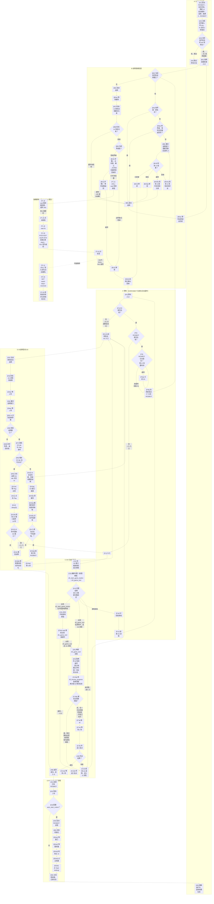

# ROSBOT 启动流程（Mermaid 版）

```mermaid
%%{init: {'themeVariables': {'fontSize': '45px', 'primaryFontSize': '45px', 'secondaryFontSize': '45px', 'tertiaryFontSize': '45px', 'fontFamily': 'arial'}}}%%
flowchart TB
    subgraph A["A 入口与定时器"]
        A1_Start["[A1] 启动 ROSBOT，设总状态、更新 UI<br/>启动顺序：战网→暗黑3→ROSBOT"]
        A2_Timer["[A2] 全局定时器 1 秒 tick，% 实现 2 秒驱动"]
        A3_Tick{"[A3] 总状态开启且本 tick 有导向？"}
        A_Skip["[A4] 跳过所有分支"]
        A9_MainEnd["[A9] 面板运行中，启用周期任务"]
        A1_Start --> A2_Timer
        A2_Timer --> A3_Tick
        A3_Tick -->|否，跳过| A_Skip
        A3_Tick -->|是，→B1 战网就绪| B1_Entry
    end

    subgraph B["B 战网就绪检查"]
        B1_Entry["[B1] 战网就绪检查入口"]
        B2_HasWin{"[B2] 当前是否有战网窗口？"}
        B3_StartBN["[B3] 启动战网"]
        B3w_Wait["[B3w] 等待数秒"]
        B4_LoginPage{"[B4] 首界面：登陆页？"}
        B5_Exit["[B5] 退出战网"]
        B4p_BrowserWait{"[B4p] 首界面：等待浏览器返回页？"}
        B6_Activate["[B6] 激活战网窗口<br/>需置顶激活战网 UI"]
        B7_WaitUI["[B7] 轮询 UI 直到出现确切元素"]
        B8_Found{"[B8] 轮询 UI 找到元素？"}
        B9_UIState{"[B9] 当前界面是？"}
        B10_Agree["[B10] 步骤1：点同意、确认<br/>→打开浏览器网易登录页"]
        B11_OAuth["[B11] 步骤2：等待油猴返回"]
        B12_Ok["[B12] 继续"]
        B5w_ExitWait["[B5w] 等待战网退出完成"]
        B13_Poll{"[B13] 轮询 UI 结果？"}
        B14_Ok["[B14] 继续"]
        B15a_Offline["[B15a] 掉线"]
        B15b_Timeout["[B15b] 轮询 UI 超时未找到元素"]
        B15c_Other["[B15c] 轮询 UI 其他未知状态"]
        B16_Confirmed["[B16] 战网已确认登录"]
        B1_Entry --> B2_HasWin
        B2_HasWin -->|无| B3_StartBN
        B2_HasWin -->|有| B4_LoginPage
        B4_LoginPage -->|是| B5_Exit
        B4_LoginPage -->|否| B4p_BrowserWait
        B4p_BrowserWait -->|是| B5_Exit
        B4p_BrowserWait -->|否| B6_Activate
        B3_StartBN --> B3w_Wait
        B3w_Wait --> B7_WaitUI
        B7_WaitUI --> B8_Found
        B8_Found -->|超时未找到| B5_Exit
        B8_Found -->|找到| B9_UIState
        B9_UIState -->|登录界面| B10_Agree
        B9_UIState -->|主界面/已登录| B12_Ok
        B10_Agree --> B11_OAuth
        B10_Agree -.->|打开浏览器| T1_WaitBtn
        B11_OAuth -->|超时→B5 退出战网| B5_Exit
        B5_Exit --> B5w_ExitWait
        B5w_ExitWait --> B1_Entry
        T1_Close -.->|oauth-done，B11 返回| B12_Ok
        B11_OAuth -->|返回| B12_Ok
        B6_Activate --> B13_Poll
        B13_Poll -->|已登录| B14_Ok
        B13_Poll -->|掉线| B15a_Offline
        B13_Poll -->|超时| B15b_Timeout
        B13_Poll -->|其他| B15c_Other
        B15a_Offline --> B5_Exit
        B15b_Timeout --> B5_Exit
        B15c_Other --> B6_Activate
        B14_Ok --> B16_Confirmed
        B12_Ok --> B16_Confirmed
    end

    subgraph TM["油猴脚本（与 B10/B11 配合）"]
        T1_WaitBtn["[T1.1] URL1 wait 登录按钮"]
        T1_WaitSrv["[T1.2] wait 服务器连接，超时 30s"]
        T1_Click["[T1.3] 点击按钮"]
        T1_Wait5["[T1.4] wait 5s"]
        T1_Notify["[T1.5] POST/GET oauth-done<br/>后端记录 step1，B11 视为返回"]
        T1_Close["[T1.6] 关标签"]
        T1_WaitBtn --> T1_WaitSrv
        T1_WaitSrv -->|连上或超时| T1_Click
        T1_Click --> T1_Wait5
        T1_Wait5 --> T1_Notify
        T1_Notify --> T1_Close
        T2_Enter["[T2.1] URL2 进入该页(点后跳转)"]
        T2_Query["[T2.2] GET oauth-step1-received"]
        T2_Log["[T2.3] 若收到则本页记录成功日志"]
        T1_Close -.->|可能跳转| T2_Enter
        T2_Enter --> T2_Query
        T2_Query --> T2_Log
    end

    B16_Confirmed --> F_Entry

    subgraph F["F 预判（D3/ROSBOT 在线与日志超时）"]
        F_Entry["[F0] 预判入口"]
        F1_HasD3{"[F1] D3 是否在线？"}
        F1c_EndD3["[F1c] 结束 D3 进程"]
        F1d_Offline["[F1d] 识别到掉线"]
        F2_RosbotOnline{"[F2] ROSBOT 是否在线？"}
        F3_LogTimeout{"[F3] ROSBOT 日志超时？<br/>按 UI 设置时间"}
        F4a_EndD3["[F4a] 关闭 D3"]
        F4b_SendF7["[F4b] 向系统发送 F7 关闭 ROSBOT"]
        F_Entry --> F1_HasD3
        F1_HasD3 -->|否<br/>→D1 从战网启动 D3| D1_Entry
        F1_HasD3 -->|是| F2_RosbotOnline
        F1c_EndD3 --> F_Entry
        F1d_Offline --> F1c_EndD3
        F2_RosbotOnline -->|否<br/>→C1 入口| C1_Entry
        F2_RosbotOnline -->|是| F3_LogTimeout
        F3_LogTimeout -->|未超时<br/>回到 F3| F3_LogTimeout
        F3_LogTimeout -->|超时| F4a_EndD3
        F4a_EndD3 --> F4b_SendF7
        F4b_SendF7 --> B2_HasWin
    end

    subgraph C["C D3 已运行直连"]
        C1_Entry["[C1] 入口"]
        C2_Resize["[C2] 将 D3 窗口缩放到标准分辨率"]
        C3_Screenshot["[C3] 截屏识图（前提）<br/>模板 d3_start_game_button / d3_game_tool"]
        C4_Result{"[C4] 识图结果<br/>由 C3 截屏识图决定"}
        C5_StartGame["[C5] 点击开始游戏按钮"]
        C5w_Wait["[C5w] wait 直到出现 d3_game_tool 或超时"]
        C9_MapCheck["[C9] 按两次 M 检测悬赏<br/>（防止地图已开时按一次反而关闭）"]
        C12_EndD3["[C12] 结束 D3 进程，进入 D 流程"]
        C6_GameTool["[C6] 继续 d3_game_tool 流程"]
        C7a_PressM["[C7a] 按 M"]
        C7w_Wait["[C7w] 等待 2 秒"]
        C7b_Teleport["[C7b] 传送三连点"]
        C8_Result{"[C8] 传送结果？"}
        C10_Check["[C10a] 用 d3_bounty_progress 查悬赏图<br/>两次按 M 两次检测"]
        C10_Result{"[C10b] 都未出现悬赏图？"}
        C11w_Wait["[C11w] 等待 2 秒"]
        C11b_Teleport["[C11b] 传送三连点"]
        C1_Entry --> C2_Resize
        C2_Resize --> C3_Screenshot
        C3_Screenshot --> C4_Result
        C4_Result -->|出现 d3_start_game_button<br/>在开始游戏界面| C5_StartGame
        C4_Result -->|出现 d3_game_tool<br/>在游戏中，走 C6 流程| C6_GameTool
        C4_Result -->|游戏掉线| F1d_Offline
        C4_Result -->|未匹配，进入 D| C12_EndD3
        C5_StartGame --> C5w_Wait
        C5w_Wait -->|超时，→C12| C12_EndD3
        C5w_Wait -->|出现 d3_game_tool<br/>走 C6 流程| C6_GameTool
        C6_GameTool --> C9_MapCheck
        C9_MapCheck --> C10_Check
        C10_Check --> C10_Result
        C10_Result -->|是，两次都未出现悬赏图<br/>视为游戏掉线| C12_EndD3
        C10_Result -->|否，任一次出现悬赏进度<br/>→传送三连点| C7a_PressM
        C7a_PressM --> C7w_Wait
        C7w_Wait --> C7b_Teleport
        C7b_Teleport --> C8_Result
        C8_Result -->|成功| A8_Success
        C8_Result -->|失败| C12_EndD3
    end

    subgraph D["D 从战网启动 D3"]
        D1_Entry["[D1] 从战网启动 D3 入口"]
        D2_StartBN["[D2] 无战网则启动战网"]
        D3_EndD3["[D3] 若有 D3 进程则结束"]
        D3w_Wait["[D3w] 等 5 秒"]
        D4_Activate["[D4] 激活战网窗口"]
        D4w_Wait["[D4w] 等 1 秒"]
        D5_UI["[D5] UI 识别战网界面"]
        D6_HasWin{"[D6] 找到战网窗口？"}
        D_Fail["[D6f] 本步失败，返回失败"]
        D7_FindTab["[D7] 查找 D3 tab 与 Play 控件"]
        D8_TabOk{"[D8] 找到 D3 tab 且可点击？"}
        D9_ClickTab["[D9] 点击战网 D3 tab 对应 UI"]
        D10_UIState["[D10] UI 状态判断，登录或重启战网"]
        D11w_WaitPlay["[D11w] 等 Play 出现"]
        D11_Click["[D11] 点击 Play"]
        D12_Sleep["[D12] sleep(5)"]
        D12b_Poll["[D12b] 轮询 D3 窗口最多 10 秒"]
        D13_HasD3Win{"[D13] 10 秒内找到 D3 窗口？"}
        D14_Restart["[D14] 重启战网"]
        D14w_Wait["[D14w] 等 5 秒"]
        D15a_Scale["[D15a] D3 窗口缩放"]
        D15b_Clear["[D15b] 清缓存"]
        D16a_Match["[D16a] 截图匹配开始游戏按钮"]
        D16b_Click["[D16b] 点击开始游戏"]
        D17_ClickOk{"[D17] 成功点击「开始游戏」？"}
        D18a_Kill["[D18a] 结束已有 ROSBOT"]
        D18b_Start["[D18b] 若配置则启动并自动化"]
        D1_Entry --> D2_StartBN
        D2_StartBN --> D3_EndD3
        D3_EndD3 --> D3w_Wait
        D3w_Wait --> D4_Activate
        D4_Activate --> D4w_Wait
        D4w_Wait --> D5_UI
        D5_UI --> D6_HasWin
        D6_HasWin -->|否| D_Fail
        D6_HasWin -->|是| D7_FindTab
        D7_FindTab --> D8_TabOk
        D8_TabOk -->|是| D9_ClickTab
        D8_TabOk -->|否| D10_UIState
        D10_UIState --> D1_Entry
        D9_ClickTab --> D11w_WaitPlay
        D11w_WaitPlay --> D11_Click
        D11_Click --> D12_Sleep
        D12_Sleep --> D12b_Poll
        D12b_Poll --> D13_HasD3Win
        D13_HasD3Win -->|否| D14_Restart
        D14_Restart --> D14w_Wait
        D14w_Wait --> D1_Entry
        D13_HasD3Win -->|是<br/>→C1 入口| C1_Entry
        D15a_Scale --> D15b_Clear
        D15b_Clear --> D16a_Match
        D16a_Match --> D16b_Click
        D16b_Click --> D17_ClickOk
        D17_ClickOk -->|否| D14_Restart
        D17_ClickOk -->|是| D18a_Kill
        D18a_Kill --> D18b_Start
        D18b_Start --> A8_Success
    end

    C12_EndD3 --> D1_Entry
    A8_Success["[A8] 返回成功，进入 E"] --> E1_Kill

    subgraph E["E ROSBOT 运行流程"]
        E1_Kill["[E1] 结束已有 ROSBOT"]
        E2_Sleep["[E2] 等待 1 秒"]
        E3_Config{"[E3] 配置 auto_start_rosbot？"}
        E4_Start["[E4] 启动 ROSBOT 进程"]
        E5_Init["[E5] 任务初始化"]
        E5a_WaitWin["[E5a1] 等窗口"]
        E5a_WaitSrv["[E5a2] 等服务器"]
        E5a_PollUI["[E5a3] 轮询主 UI"]
        E5a_ClickProfile["[E5a4] 点主档案"]
        E5a_ClickStart["[E5a5] 点 Start botting!"]
        E6_Done["[E6] 主线程收尾，记录日志"]
        E1_Kill --> E2_Sleep
        E2_Sleep --> E3_Config
        E3_Config -->|否| E6_Done
        E3_Config -->|是| E4_Start
        E4_Start --> E5_Init
        E5_Init --> E5a_WaitWin
        E5a_WaitWin --> E5a_WaitSrv
        E5a_WaitSrv --> E5a_PollUI
        E5a_PollUI --> E5a_ClickProfile
        E5a_ClickProfile --> E5a_ClickStart
        E5a_ClickStart --> E6_Done
        E6_Done --> A9_MainEnd
    end
```
